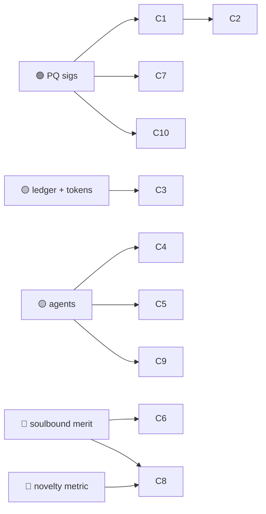

# 09 — Creative, Media, IP & Culture

> In an era of generative AI, the scarce things are **provenance** ("a human/this model made
> this, then"), **attribution** ("whose work is in this?"), and **authenticity** ("this is real,
> not a deepfake"). Huxplex's PQ-durable signing + agent attribution + soulbound merit map onto
> the creative economy's deepest 2026 anxieties.

## Use-case catalogue

| # | Use case | Horizon | Diff. | Edge | Notes |
|---|---|---|---|---|---|
| C1 | Content provenance / authenticity signing (C2PA, PQ edition) | 🟩 | 🟠 | PQ | "This image's capture/edit chain is real" — durable vs. quantum forgery |
| C2 | Deepfake defense via signed-at-capture provenance | 🟦 | 🔴 | PQ · AI | Authenticity by *positive* attestation, not detection arms race |
| C3 | Royalty splitting & micro-licensing (programmable) | 🟩 | 🟠 | AI | Automatic splits to all contributors on each use |
| C4 | AI-assisted authorship attribution (human + which models) | 🟦 | 🟠 | AI · MERIT | Granular credit: who prompted, which model, who edited |
| C5 | Training-data licensing & accounting (consent + pay creators) | 🟦 | 🔴 | SOV · AI | Creators license work to model trainers; usage accounted |
| C6 | Soulbound artistic reputation (portable, unsellable) | 🟦 | 🔴 | MERIT | Track record that can't be bought; resists fake-clout markets |
| C7 | Cultural archives preserved for centuries | 🟪 | 🟠 | PQ | Heritage that survives institutions and the quantum transition |
| C8 | Novelty/originality signals for creative work | 🟪 | 🔴 | MERIT | The riskiest idea applied to art — opt-in, advisory only |
| C9 | Agent-created works with clear authorship & liability | 🟦 | 🔴 | AI · SOV | When an agent makes art, who owns/answers for it |
| C10 | Live performance / event ticketing with anti-scalp provenance | 🟩 | 🟠 | PQ | Non-forgeable, transfer-controlled tickets |

## Expanded narratives

### C1 + C2 — Win by proving the real, not chasing the fake (🟩→🟦)
Deepfake *detection* is a losing arms race. **Provenance** flips it: media is signed at the
point of capture/creation and through every edit, so authenticity is a *positive* claim you can
verify rather than a forgery you must catch. The PQ angle matters because a provenance signature
must remain unforgeable for the *archival life* of the content — a quantum-forged "authentic"
historical photo is a uniquely corrosive thing. This builds directly on the 🟢 signing primitives
and is a strong, timely near-term application.

### C3 + C5 — Paying everyone whose work is inside the output (🟩/🟦)
Programmable royalties (C3) split revenue to every contributor automatically on each use —
trivial once a ledger exists. The harder, more important one is **training-data licensing**
(C5): a marketplace where creators consent to and are paid for their work entering model
training, with usage accounted. It directly addresses the central economic grievance of the
generative-AI era — and it's hard precisely because measuring "how much of this output came from
your work" is unsolved (and brushes against the novelty-measurement frontier).

### C8 — Originality scoring for art (🟪 🔴 · don't oversell)
Applying causal-novelty measurement to creative work is the most seductive and most dangerous
form of the project's riskiest idea. Art's value is not reducible to a non-redundancy metric, and
any such score becomes an instant optimization target (and an aesthetic straitjacket). Per
[ADR-0007](../adr/0007-sentience-framing.md): if it exists at all, it is **opt-in, advisory, and
never a gate** on what gets made, funded, or seen.

## Dependencies

## Failure modes & honest caveats
- **Provenance proves a signing key acted, not that a claim is true** — a signed lie is still a
  lie; key compromise and "authentic-but-misleading" remain.
- **Creative-industry adoption** depends on platforms/cameras integrating signing at source —
  largely outside Huxplex's control (it's an ecosystem play, e.g. C2PA).
- **Novelty/originality scoring for art is reputationally radioactive**; treat as research.

---

### Open Questions
- Can training-data licensing (C5) attribute output to inputs well enough to pay fairly, or is
  "fair" fundamentally unmeasurable for generative models?
- Does soulbound artistic reputation help artists or entrench gatekeeping under a new name?
- What's the right relationship to existing standards (C2PA) — extend them with PQ, or compete?
