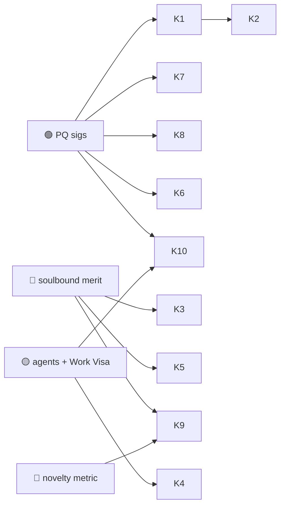

# 10 — Knowledge & Education

> Credentials people trust, knowledge that survives, and learning mediated by accountable AI
> tutors. The unifying Huxplex angle: **verifiable, long-lived, portable records of what someone
> knows and did**, plus agents that teach within human-set bounds.

## Use-case catalogue

| # | Use case | Horizon | Diff. | Edge | Notes |
|---|---|---|---|---|---|
| K1 | Verifiable academic & professional credentials | 🟩 | 🟠 | PQ | Degrees/certs anti-forgery, instantly checkable, decades-durable |
| K2 | Portable lifelong learning record (skills, not just degrees) | 🟦 | 🟠 | PQ · MERIT | A learner-owned transcript across institutions and employers |
| K3 | Soulbound competency reputation (earned, unsellable) | 🟦 | 🔴 | MERIT | Skill claims backed by verifiable assessment, not self-report |
| K4 | Agent tutors operating under Work-Visa bounds | 🟦 | 🔴 | AI · SOV | Personalized tutoring; human oversight; provenance of guidance |
| K5 | Knowledge commons with contribution attribution | 🟦 | 🟠 | MERIT | Wikipedia-like, with durable credit + anti-vandalism reputation |
| K6 | Century-scale archive of human knowledge ("long now") | 🟪 | 🟠 | PQ | Survives institutions, formats, and the quantum transition |
| K7 | Anti-credential-fraud for hiring & licensing | 🟩 | 🟠 | PQ | Kills diploma mills and forged licenses |
| K8 | Micro-credentials & verifiable MOOC completion | 🟩 | ⚪ | PQ | Granular, stackable, portable proof of learning |
| K9 | Novelty-aware contribution credit in collaborative knowledge | 🟪 | 🔴 | MERIT | Reward non-redundant additions — opt-in, advisory |
| K10 | Provenance of AI-generated educational content | 🟦 | 🟠 | PQ · AI | Which model produced this lesson, with what sources |

## Expanded narratives

### K1 + K7 — The boring, valuable wedge (🟩 🟠/⚪)
Credential fraud is a multi-billion-dollar problem and degree verification is still phone calls
and PDFs. PQ-signed, instantly-verifiable credentials that stay valid for a *career* (and beyond
the quantum transition) are a clean, near-term, low-speculation application — strong precisely
because they need only the 🟢 signing primitives and a ledger. The catch is adoption:
credentials are only useful if issuers (universities, licensing boards) actually sign them, which
is an ecosystem and standards effort more than a technical one.

### K2 + K3 — Owning your own record (🟦)
Move from institution-owned transcripts to a **learner-owned** lifelong record: every course,
assessment, and demonstrated skill as verifiable claims the person carries between schools and
employers. Add **soulbound competency reputation** (K3) and skill claims become backed by
verifiable assessment rather than self-report — though, as everywhere with merit scoring, this
inherits the [ADR-0007](../adr/0007-sentience-framing.md) guardrails and the risk of becoming a
gameable, permanent caste marker.

### K4 — Tutors that can't go off the rails (🟦 🔴)
Personalized AI tutoring is among the highest-value near-term uses of agents — but for minors and
high-stakes learning, *bounded* authority and *provenance of guidance* matter enormously. A
tutor agent under a **Work Visa** has scoped capabilities, a human (teacher/parent) override, and
a signed record of what it advised. This is the education-flavored instance of the project's core
"autonomy + enforceable limit" pattern.

### K6 — A ledger for the long now (🟪 🟠 · the romantic one)
A civilization-scale, tamper-proof, institution-independent archive of human knowledge that is
*designed* to outlive its founders, format churn, and the cryptographic era it was born in. The
PQ foundation is exactly suited to the "must remain verifiable for centuries" requirement.
Technically only 🟠 (it's signing + replication + governance, not novel research), but it's 🟪 on
horizon because the hard parts are *social and institutional*: who maintains it, who funds it,
and how its neutrality is preserved across generations.

## Dependencies

## Failure modes & honest caveats
- **Issuer adoption is the whole game** — a credential nobody signs is worthless; this is a
  standards/network-effects problem, not a crypto one.
- **Soulbound skill reputation** risks entrenching inequality and is gameable; needs decay,
  appeal, and never gating opportunity automatically.
- **AI tutors raise child-safety, bias, and dependency concerns** beyond what a ledger addresses.

---

### Open Questions
- What incentive moves universities/licensing boards to issue verifiable credentials at scale?
- Can a learner-owned record avoid becoming a permanent, unforgiving dossier?
- Who governs and funds a century-scale knowledge archive so it stays neutral for that long?
