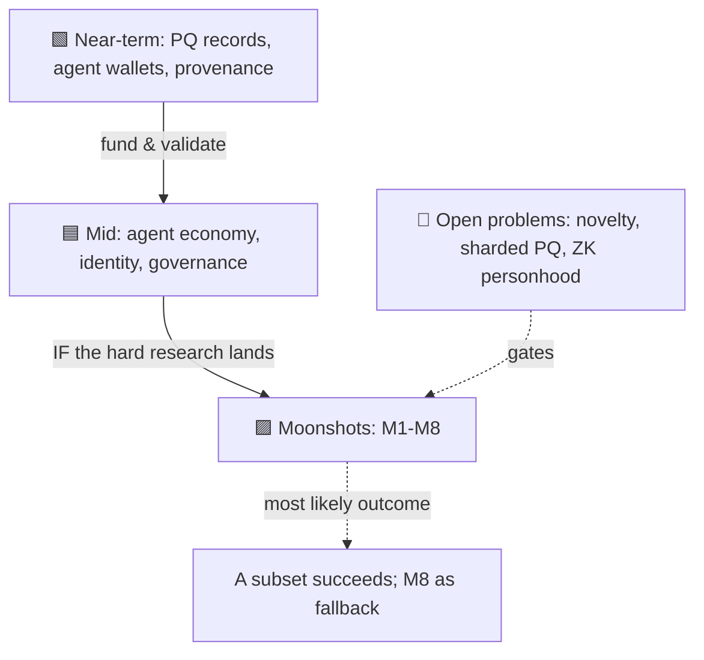

# 14 — Very Ambitious / Civilizational

> The moonshots. Everything here is 🟪 (10 yrs+ / civilizational) and most are 🔴 (depend on
> unproven or unsolved breakthroughs). Some may be impossible. They are catalogued not as
> promises but as the *direction* the thesis points if it fully succeeds — the answer to "what is
> this ultimately *for*?" Read this file alongside the standing caution: the project's
> credibility must **never** be staked on any single entry here.

## Why list moonshots at all?

Because the near-term use cases ([the 🟩 column](00-master-matrix.md)) only make sense as steps
toward *something*. A post-quantum notary is useful; a post-quantum notary that's also the first
brick of a substrate for an accountable machine civilization is a *direction*. The discipline —
repeated from the [executive summary](../00-executive-summary.md) — is to **build the bricks and
let the cathedral remain a hypothesis.**

## The civilizational use cases

### M1 — Substrate for a machine-majority economy (🟪 🔴 · the core thesis, maxed out)
If autonomous agents come to *dominate* transaction volume — contracting, employing each other,
forming capital, running services — they need neutral rails built for them, with humans kept in
the loop by construction. Huxplex's end-state claim is to be *that* substrate: an economy where
machines are the majority of actors but **human sovereignty is non-negotiable infrastructure**.
This is the union of [the agent economy](02-ai-agent-economy.md) (A12) and
[sovereignty](03-identity-personhood-sovereignty.md) (I9) at full scale. Depends on essentially
every hard problem in the project being solved at once.

### M2 — A measured contribution economy (🟪 🔴 · the deepest bet)
An economy that rewards **non-redundant causal contribution** rather than capital or labor-hours
— where standing flows from what you genuinely *add*. If the novelty-measurement research line
ever became sound and collusion-resistant (a very large "if," per
[ADR-0007](../adr/0007-sentience-framing.md)), it would be a genuinely new economic primitive. It
is equally likely to be impossible or to collapse into a gamed metric. Listed as the project's
highest-risk, highest-meaning aspiration.

### M3 — Interplanetary / high-latency settlement (🟪 🔴)
Wall-clock consensus breaks across light-minutes (Earth–Mars is 3–22 min one way). Huxplex's
**causal ordering** (vector + hybrid logical clocks) is, in principle, the right model for
coordination where "now" is meaningless and only *what-caused-what* is well-defined. A settlement
and coordination layer for a multi-world economy is the most literally far-out entry — and a
domain where the causal-clock idea has a real, non-gimmick advantage.

### M4 — A constitution that binds a superintelligent polity (🟪 🔴)
Can a small set of **unamendable invariants** — humans keep the veto, certain rights are
inviolable — survive a governance system dominated by far more capable AI voting power and
capital? This is partly cryptography, mostly social contract, and possibly impossible. It is also
arguably the most *important* thing the project could attempt: a credible mechanism for keeping
advanced machine systems accountable to humans is among civilization's open safety problems. See
[governance G8](06-governance-civics-public-sector.md) and
[philosophy Q3](13-philosophical-implications.md).

### M5 — The long-now ledger (🟪 🟠 · technically the most reachable moonshot)
A civilization-scale, institution-independent, tamper-proof archive — of records, knowledge,
heritage, commitments — *designed to remain verifiable for centuries* across the quantum
transition and beyond any founding institution. Only 🟠 in difficulty (it's PQ signing +
replication + durable governance, not new science), but 🟪 in horizon because the binding
constraints are **social and multi-generational**: funding, neutrality, and stewardship across
lifetimes. Possibly the most *achievable* item in this file and a strong candidate for the
project's "north star" framing.

### M6 — Post-labor dignity & contribution accounting (🟪 🔴)
If agents do most economic work, the link between *income* and *survival* breaks. A merit/dignity
layer that recognizes human contribution (and guarantees a floor) *independent of wage labor*
could be social infrastructure for a post-labor world. Deeply entangled with the inequality risks
in [impact on society](11-impact-on-society.md) — could be liberating or could be a caste engine.

### M7 — Verifiable autonomy as global safety infrastructure (🟪 🔴)
Generalize [defense D5/D10](08-security-defense-critical-infra.md): a planet-wide standard for
*provably bounded* autonomous systems — every consequential agent's authority cryptographic,
inspectable, and haltable. If autonomous systems proliferate into safety-critical roles, neutral
infrastructure for proving and containing their authority becomes a civilizational need. The hard
truth remains: on-chain bounds don't bound physical effects without hardware interlocks.

### M8 — Export as a module suite, not a sovereign chain (🟪 🟠 · the pragmatic endgame)
The readme's v4 future and a genuine strategic fork: maybe Huxplex's lasting contribution is not
a sovereign L1 at all, but a **set of reusable modules** — PQ pruning, the causal clock, the
novelty library, soulbound merit, crypto-agility — adopted by *other* chains and systems. Lower
glory, possibly higher impact, and a hedge against the "solo team can't build a civilization-scale
L1" risk (#5). Flagged in the [executive summary's open questions](../00-executive-summary.md).

## The honest framing

The likeliest *good* outcome is not "all of M1–M7 arrive" but "the near-term column succeeds
commercially, a few mid-term use cases mature, and the project's durable legacy is some of M5
(the archive) and M8 (the modules)." That would already be a significant contribution. The rest
is the hypothesis that justifies the direction — held honestly as a hypothesis.

---

### Open Questions
- Of M1–M8, which depend on the *same* research blocker, so that one breakthrough unlocks
  several? (Likely: a sound, collusion-resistant contribution metric gates M2 and M6.)
- Is M8 (module suite) the *responsible* primary strategy given team-size risk, with the
  sovereign chain as the stretch goal — rather than the other way around?
- For M4 (binding a superintelligent polity): is there *any* mechanism that is more than a social
  fiction, or is the honest claim simply "we make the commitment and hope"?
- Which single moonshot, if achieved, would most justify the entire program — and which would
  most discredit it if pursued prematurely?
