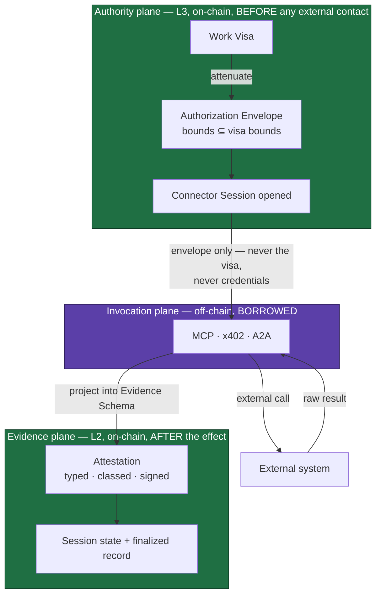
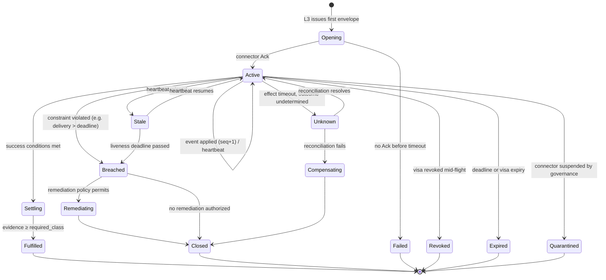
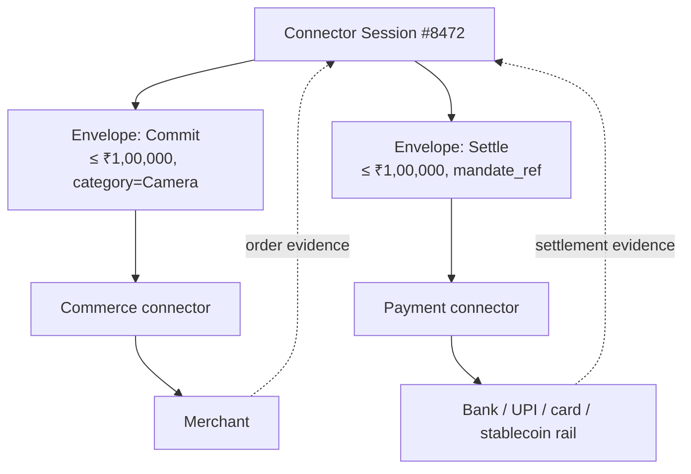

# 07 — Connector Protocol (HCP/1)

> **Status:** 🟡 Specified, unbuilt. Gate **G11** in [`16-action-plan.md`](../16-action-plan.md);
> Phase 3–4. Explicitly **out of v1 scope** ([06](06-v1-scope.md) §3).
>
> **Origin:** the connector concept comes from the founder's notes
> ([`brainstorming/00-arun-babu-founding-notes.md`](../brainstorming/00-arun-babu-founding-notes.md)
> §Steps 7–11, 14–18). Nothing equivalent exists elsewhere in the blueprint.
>
> **Normative language:** RFC 2119 / RFC 8174. Lowercase "must" is prose.

## 1. What this specifies

The **Huxplex Connector Protocol (HCP/1)** — how the substrate and its agents cause and observe
effects in systems Huxplex does not control (merchants, banks, carriers, devices, registries),
without ever loosening the authority that bounds them.

### 1.1 The three hard requirements

| # | Requirement | Where satisfied |
|---|---|---|
| **R1** | A connector is the pathway between the substrate/agents and the outside world | §3 three-plane architecture |
| **R2** | A connector MUST NOT override, widen, or bypass any bounded authority, policy, or visa | §5 Authorization Envelope; §13 adversary model |
| **R3** | A connector MUST stay open for the complete lifecycle of the agent or intent until it completes | §4 Connector Session |

R2 is enforced **structurally**, not by connector good behaviour: a connector never receives the
visa, never receives user credentials, and cannot act without a pre-issued, pre-narrowed
capability. R3 is satisfied by making the session a first-class, durable protocol object rather
than a transport connection.

### 1.2 Shortcomings this protocol exists to solve

| # | Shortcoming | Solution | §|
|---|---|---|---|
| S1 | MCP notifications are session-scoped; intents run for days | Durable session + gapless signed event stream + heartbeats | §4, §8 |
| S2 | MCP results are free-form JSON; consensus needs canonical bytes | Typed Evidence Schemas; raw payload committed by hash, kept off-chain | §7.4 |
| S3 | MCP trusts servers by configuration | Connector DID with PQ keys + on-chain registry | §6 |
| S4 | First-party and third-party evidence are not interchangeable | Evidence Class lattice, carried in every record | §7.2 |
| S5 | A signature proves receipt, not truth | Five separated evidence claims; classes gate settlement | §7.3 |
| S6 | Retries, duplicates, out-of-order callbacks | Effect Keys, gapless sequencing, explicit `Unknown` | §9 |
| S7 | Merchant-of-record and fraud liability | Registry records legal identity + jurisdiction | §12 |
| S8 | The connector list is a wish list, not a roadmap | Conformance Profiles 0–3, shipped in order | §11 |
| S9 | External APIs rot | Adapter/schema separation + continuous conformance testing | §11.2 |
| S10 | A compromised connector must not be catastrophic | Envelope bounds, aggregate caps, bonding, quarantine | §13 |
| S11 | Payment authority must be separate from commerce authority | Disjoint action classes, separate connectors and envelopes | §10 |
| S12 | Huxplex must never hold user credentials | Structural: credentials never enter the protocol | §10.1 |

## 2. Vocabulary

| Term | Definition |
|---|---|
| **Connector** | A registered adapter that translates between HCP and one external system. Off-chain. Not a validator. |
| **Connector Session (CS)** | The durable on-chain object binding {intent, visa, connector} for the intent's whole lifecycle. |
| **Authorization Envelope (AE)** | A single-purpose, attenuated, expiring capability issued by L3 that permits exactly one action class within explicit bounds. |
| **Effect Key** | The idempotency key for an external effect: `H(session_id ‖ envelope_id ‖ nonce)`. |
| **Attestation** | A connector-signed, schema-typed evidence record. |
| **Evidence Class** | The trust category of an attestation (§7.2). |
| **Evidence Schema** | A registered, versioned typed structure that external results are projected into. |
| **Connector Registry** | On-chain record of connector identity, capabilities, bond, profile, and legal operator. |

## 3. Architecture — three planes

The central structural decision: **authority, invocation, and evidence are separate planes with
separate protocols.** Authority resolves entirely before invocation. Evidence is produced entirely
after it. The invocation plane is borrowed, not built.



**Invariant A1 (authority precedence).** No connector invocation MAY occur without a valid,
unexpired, unspent Authorization Envelope. Implementations MUST make this structurally
impossible, not merely checked.

**Invariant A2 (no upward flow).** No message from the invocation or evidence plane can create,
widen, or extend authority. Evidence can only *satisfy* or *fail* conditions already declared in
the envelope.

MCP never learns that Huxplex exists. Huxplex never learns the external system's internals. This
is the founder's requirement — *"Huxplex should not need to understand Amazon's internal
implementation"* — expressed as a layering rule.

## 4. The Connector Session — satisfying R3

An MCP session is a transport connection that dies. The intent does not. HCP therefore anchors
the lifecycle in an **on-chain session object** that outlives connections, agent processes, node
restarts, and days of wall-clock time.

### 4.1 State

```
ConnectorSession {
  session_id:        H(intent_id ‖ visa_id ‖ connector_id ‖ open_nonce)
  intent_id, visa_id, agent_did, connector_did
  profile:           Profile0 | Profile1 | Profile2 | Profile3
  state:             SessionState
  event_seq:         u64          // highest contiguous sequence applied
  pending_effects:   [EffectKey]  // issued, unresolved
  evidence_root:     Hash         // JMT root over accepted attestations
  required_class:    EvidenceClass  // minimum to consider fulfilled (from intent/visa)
  opened_at, deadline, last_heartbeat: BlockHeight
  rent_escrow:       Value
}
```

`session_id` binds the session to exactly one intent, one visa, and one connector. A session MUST
NOT be reusable across intents.

### 4.2 Lifecycle



Terminal states are `Fulfilled`, `Closed`, `Failed`, `Revoked`, `Expired`, `Quarantined`. Every
terminal transition MUST deterministically settle escrow and release session rent.

This state machine is the founder's §Steps 14–16 made normative: monitoring across days
(`Active` + events), delayed delivery (`Breached` → `Remediating`), and price change at checkout
(the envelope simply fails — see §5.3).

### 4.3 Durability requirements

- A session MUST survive node restart, agent process death, and connector disconnection.
- A session MUST be resumable by **any** agent instance holding the agent DID. Sessions belong to
  the intent and visa, **not** to a process. This is what makes R3 hold across an agent's own
  lifecycle.
- A session MUST have a `deadline` no later than `min(intent deadline, visa expiry)`.
- Open sessions consume state and MUST pay **session rent** from `rent_escrow`, refunded on clean
  terminal close. This prevents session-spam as a state-growth attack.

### 4.4 Liveness

The connector MUST emit a signed heartbeat at least every `heartbeat_interval` blocks while the
session is `Active`. A missed heartbeat moves the session to `Stale`; a `Stale` session past
`liveness_deadline` is treated as a constraint breach and enters remediation.

Rationale: without this, a connector that simply stops responding leaves the intent hanging
forever. Silence must be a detectable, actionable event — not an indefinite wait.

## 5. The Authorization Envelope — satisfying R2

### 5.1 Structure

```
AuthorizationEnvelope {
  envelope_id, session_id, intent_id, visa_id
  connector_did:      exactly one connector
  action_class:       typed enum (§5.4)
  params_commitment:  H(canonical action parameters)
  bounds: {
    max_value, currency,
    allowed_categories, allowed_counterparties,
    deadline, max_ancillary (shipping/fees/tax),
    ...typed constraint set
  }
  required_evidence_class: EvidenceClass
  nonce, not_before, not_after
  single_use:         bool
  issuer_sig:         ML-DSA-44 over context "huxplex-{net}:connector:envelope:v1"
}
```

### 5.2 The attenuation rule

**Invariant A3.** For every envelope `e` derived from visa `v`:

```
bounds(e) ⊆ bounds(v)      and      action_class(e) ∈ capabilities(v)
```

This subset check MUST be **decidable on-chain** — which is why `bounds` is a typed constraint
set, not free-form policy. Attenuation is monotonic: an envelope may only narrow. This is
[`16-action-plan.md`](../16-action-plan.md) **G9-T2** applied at the connector boundary.

**Invariant A4 (no re-delegation upward).** A connector MUST NOT issue envelopes. Only L3 may.
A connector that needs a sub-action MUST request a new envelope through the session, which
re-enters the authority plane.

### 5.3 Why the price-change case works

The founder's §Step 16: advertised ₹72,999, checkout ₹1,04,500, visa cap ₹1,00,000.

The envelope carries `max_value = ₹1,00,000`. At checkout the connector's requested effect value
exceeds the envelope. **The connector cannot proceed** — not because it chooses not to, but
because it holds no capability covering that value. It MUST return `EnvelopeExceeded` with the
observed value. The agent may then request a new envelope (which L3 will refuse, since ₹1,04,500
also exceeds the visa) or search for another product.

> *"The policy wins"* is therefore not a runtime check inside the connector. It is a property of
> what the connector was ever given.

### 5.4 Action classes

Action classes are **disjoint and typed**. A connector registered for one MUST NOT be able to
perform another.

| Class | Effect | Minimum profile |
|---|---|---|
| `Observe` | Read external state; no side effect | 0 |
| `Reserve` | Create a reversible hold (cart, quote, booking hold) | 1 |
| `Commit` | Create an irreversible external obligation (place order) | 1 |
| `Settle` | Move value on an external rail | 2 |
| `Compensate` | Cancel, refund, return, release | 1 |
| `Custody` | Hold on-chain value | 3 |

`Settle` and `Commit` are separate classes precisely so that commerce authority and payment
authority cannot be conflated (§10).

## 6. Connector identity and registry — solving S3

### 6.1 Identity

Every connector MUST have a `did:huxplex` identity ([ADR-0013](../adr/0013-did-huxplex-method.md))
with the hybrid key model of [ADR-0002](../adr/0002-cryptographic-parameter-set.md):

- **SLH-DSA-128s** long-lived root key — identity, key rotation authority.
- **ML-DSA-44** operational key — per-attestation signing.

A connector is **not** required to be a validator or run a node. Attestations are signed
off-chain and MAY be submitted on-chain by the agent; the connector's signature makes
agent-submission safe. This matters for adoption: a merchant will integrate an endpoint, but
will not run consensus.

### 6.2 Registry record

```
ConnectorRegistration {
  connector_did, root_pk (SLH-DSA), op_pk (ML-DSA)
  profile, action_classes: [ActionClass]
  evidence_classes: [EvidenceClass]   // the maximum it can legitimately assert
  schemas: [(SchemaId, Version)]
  external_system_id, endpoint_hints
  bond: Value
  aggregate_exposure_cap: Value       // per epoch, §13.3
  legal_operator, jurisdiction        // §12
  merchant_of_record: Option<Entity>
  status: Active | Probation | Suspended | Retired
  conformance_last_passed: BlockHeight
}
```

Registration is **governance-gated** for Profiles 1–3 at launch. Profile 0 (read-only) MAY be
permissionless. Permissionless higher profiles are deliberately deferred — see §17.

## 7. The evidence model — solving S2, S4, S5

### 7.1 The problem being solved

From the 2026 literature ([`17-landscape-2026.md`](../17-landscape-2026.md) §5):

> *"A hash does not establish semantic truth, a signature does not establish authorization, and
> an external anchor does not establish capture completeness."*

A naïve reading of the founder's evidence record (§Step 11) would record a merchant response, a
receipt hash and a connector signature, and treat the result as *"the camera was bought."* It is
not. It is *"a connector claims it received this from something it believes is Amazon."* HCP
forces that distinction into the type system.

### 7.2 Evidence Class lattice

Every attestation MUST carry exactly one class.

| Class | What it means | Signed by | Strength |
|---|---|---|---|
| `SelfReported` | The agent asserts it | agent | **Never sufficient** for settlement |
| `Relayed` | A third-party connector received this response | connector | Weak — proves receipt only |
| `Notarized` | *k*-of-*n* independent connectors relayed consistent results | k connectors | Medium |
| `FirstParty` | The external system itself signed its own record | external system | Strong |
| `Cryptographic` | Verifiable without trusting any connector (signed merchant receipt, TLS transcript proof, zk) | verifiable | Strongest |

Ordering: `SelfReported < Relayed < Notarized < FirstParty ≤ Cryptographic`.

A connector MUST NOT assert a class above its registered maximum. A third-party wrapper of a
public API is registered `Relayed` and **cannot** emit `FirstParty`, regardless of what it claims.

### 7.3 Separated evidence claims — solving S5

An attestation carries five **independent** boolean-or-absent claims. They MUST NOT be collapsed.

| Claim | Established by | Never established by |
|---|---|---|
| `integrity` | payload hash | signature alone |
| `receipt` | connector signature | payload hash |
| `authorization` | **the envelope** — never the evidence | any signature |
| `occurrence` | `FirstParty` / `Cryptographic` / `Notarized` | `Relayed` |
| `completeness` | gapless `seq` + unbroken heartbeat | any single record |

**Invariant A5.** `authorization` is never an evidence claim. Authority comes from the envelope
and only the envelope. An attestation asserting authorization MUST be rejected as malformed.

### 7.4 Evidence Schemas — solving S2

External payloads are not deterministic and MUST NOT enter consensus.

1. The connector receives a raw external response (free-form JSON, HTML, whatever).
2. It **projects** it into a registered, versioned `EvidenceSchema` — a fixed typed struct
   encoded per [ADR-0011](../adr/0011-canonical-serialization.md).
3. The **typed projection** and `H(raw_payload)` go on-chain. The **raw payload does not.**
4. The raw payload MUST remain retrievable off-chain for a declared retention window, and MUST
   hash to the committed value.

Example — a commerce order schema:

```
EvidenceSchema "commerce.order.v1" {
  external_ref:      String        // "AMZ-123456"
  status:            OrderStatus   // typed enum, not free text
  amount, currency
  ancillary:         { shipping, tax, fees }
  expected_delivery: Timestamp
  counterparty_id
  observed_at:       Timestamp
}
```

The schema registry is versioned and governance-updatable, mirroring the algorithm registry
(G1). This is also the primary defence against S9: when an external API changes shape, the
**adapter** changes and the **schema** does not.

### 7.5 Required class gates settlement

The intent — and therefore the visa and envelope — declares `required_evidence_class`. A session
MUST NOT reach `Fulfilled` on evidence below that class.

This puts the trust decision where the project's thesis says it belongs: **with the human, at
authorization time.** A user may say *"settle only on FirstParty or better"* for a ₹1,00,000
camera, and accept `Relayed` for a ₹200 one.

## 8. The event stream — solving S1

The session's durability requires an event channel that outlives MCP sessions.

### 8.1 Event record

```
ConnectorEvent {
  session_id
  seq:                u64        // strictly monotonic, GAPLESS, per session
  event_type:         typed enum
  schema_id, schema_version
  projection:         canonical typed payload
  payload_commitment: H(raw)
  evidence_class
  effect_key:         Option<EffectKey>
  observed_at
  connector_sig:      ML-DSA-44 over "huxplex-{net}:connector:event:v1"
}
```

### 8.2 Rules

- `seq` MUST be gapless per session. Receiving `seq = n+2` while `event_seq = n` means `n+1` is
  missing: the substrate MUST buffer, MUST NOT apply out of order, and MUST be able to demand
  replay. **Gaplessness is what makes `completeness` a checkable claim.**
- Delivery is **at-least-once**; application is **idempotent** on `(session_id, seq)`.
- Transport is deliberately unspecified — webhook, connector-initiated submission, or agent
  polling. HCP specifies the *record*, not the pipe, because MCP cannot carry a multi-day stream
  and no single transport suits every connector.
- Heartbeats (§4.4) are events with `event_type = Heartbeat` and consume a `seq`. A silent
  connector is therefore indistinguishable from a gap — which is the desired behaviour.

This directly implements the founder's §Step 18 lifecycle
(`order_confirmed → shipped → in_transit → out_for_delivery → delivered`) with each transition
signed, sequenced, classed, and independently applicable.

## 9. Idempotency and failure semantics — solving S6

### 9.1 Effect Keys

```
EffectKey = H("huxplex-{net}:connector:effect:v1" ‖ session_id ‖ envelope_id ‖ nonce)
```

A connector MUST be idempotent on Effect Key: replaying an identical envelope MUST return the
original result and MUST NOT create a second external effect. Ordering two cameras because a
request was retried is the canonical failure this prevents.

### 9.2 `Unknown` is not `Failed`

**Invariant A6.** An effect whose outcome cannot be determined MUST resolve to `Unknown`, never
to `Failed`.

This is the most important failure rule in the protocol. "We do not know whether the order was
placed" and "the order was not placed" are different facts, and conflating them causes double
purchases and double payments. An `Unknown` effect MUST enter **reconciliation**: the connector
queries the external system by Effect Key or external reference until the outcome is determined
or the session deadline passes.

### 9.3 Handling table

| Condition | Behaviour |
|---|---|
| Duplicate event, same `seq` | No-op |
| Out-of-order event | Buffer; do not apply until the gap fills |
| Timeout on a `Commit`/`Settle` | → `Unknown`, begin reconciliation |
| Reconciliation succeeds | → `Active`, apply true outcome |
| Reconciliation fails by deadline | → `Compensating` |
| Duplicate external effect detected | Compensate the surplus; slash if connector-caused |

## 10. Payment separation — solving S11, S12

### 10.1 No credential custody

**Invariant A7.** Huxplex MUST NOT accept, store, forward, or proxy user credentials for any
external system — bank credentials, card numbers, API keys, or session tokens. Credentials are
out of protocol scope entirely. This is the founder's §Step 8 constraint, and it is the single
structural property that makes a connector an oracle boundary rather than a custody boundary.

What Huxplex holds instead is a **bounded payment mandate reference**: an opaque identifier
issued by the user's payment provider, usable only within declared bounds. This maps directly
onto AP2 mandates ([`17-landscape-2026.md`](../17-landscape-2026.md) §2), which is the
recommended external representation.

### 10.2 Disjoint authority

The commerce path and the payment path are separate connectors, separate registrations, separate
envelopes, separate action classes (`Commit` vs `Settle`), correlated only by `session_id`.



**Invariant A8.** Neither connector can perform the other's action class, and neither receives
the other's envelope.

### 10.3 No atomicity — compensation instead

There is **no** two-phase commit across independent external systems, and HCP MUST NOT pretend
otherwise. The commerce and payment legs form a **saga**:

| Outcome | Response |
|---|---|
| Commit ✓, Settle ✓ | → `Settling` → `Fulfilled` |
| Commit ✓, Settle ✗ | → `Compensating`: issue `Compensate` envelope to cancel the order |
| Commit ✗, Settle ✓ | → `Compensating`: issue `Compensate` envelope to refund |
| Either `Unknown` | Reconcile first (§9.2); never compensate on an undetermined leg |

`Reserve` (a reversible hold) SHOULD be used before `Commit` wherever the external system
supports it, since it shrinks the compensation window substantially.

## 11. Profiles and conformance — solving S8, S9

### 11.1 Conformance profiles

Scope discipline is expressed as a **ladder**, shipped in order. Each profile is a distinct
security and liability posture.

| Profile | Name | Capability | Risk shape | Gate |
|---|---|---|---|---|
| **0** | Observer | `Observe` only. Reads external state, emits events. **No side effects.** | Can only lie | G11 first delivery |
| **1** | Effector | `Reserve`, `Commit`, `Compensate` | Bounded irreversible external obligations | after Profile 0 soak |
| **2** | Settler | + `Settle` on external rails | Value moves, but not custodied by Huxplex | after Profile 1 soak |
| **3** | Custodial | + `Custody` of on-chain value | **Bridge-shaped.** Custody boundary | Governance super-majority; treat as a bridge |

Profile 0 is genuinely useful alone: shipment tracking, price monitoring, and status
reconciliation all fit, and none can cause harm. **Ship Profile 0 completely before Profile 1
starts.**

### 11.2 Continuous conformance — solving S9

External APIs rot; adapters silently break. Therefore:

- Every connector MUST pass a **conformance suite** for each declared schema at registration.
- The suite MUST be re-run periodically. Failure moves the connector to `Probation`; sustained
  failure to `Suspended`.
- `conformance_last_passed` is on-chain and publicly checkable.
- Sessions bound to a `Suspended` connector move to `Quarantined` and enter remediation. They are
  **not** silently dropped.

Rot is thereby converted from a silent correctness failure into an explicit, attributable,
observable state.

## 12. Liability and jurisdiction — solving S7

Every attestation is attributable to a registered legal entity. The registry MUST record
`legal_operator`, `jurisdiction`, and — for Profile 1+ — `merchant_of_record` per action class.

This is the protocol's most direct regulatory asset. Under the EU AI Act's automatic-logging
obligation for high-risk systems, and its rule that *"compliance at the GPAI provider level does
not discharge the orchestration layer's obligations"*
([`17-landscape-2026.md`](../17-landscape-2026.md) §9), a session's evidence chain is a
purpose-built audit artifact: who authorized, under what bounds, executed by whom, evidenced how,
and with what epistemic strength.

## 13. Adversary model — solving S10

### 13.1 What each adversary can and cannot do

| Adversary | Can | Cannot |
|---|---|---|
| **Malicious connector** | Lie within its evidence class; stall; leak the envelope's contents | Exceed envelope bounds; forge another connector's attestation; touch unrelated state; obtain credentials; issue envelopes |
| **Malicious agent** | Choose which connectors and candidates to use; submit attestations it received | Forge an envelope (L3-signed); forge an attestation (connector-signed); exceed the visa |
| **Malicious external system** | Lie about its own records | Escape attribution when `FirstParty` — it signed its own lie |
| **Agent + connector colluding** | Waste the user's bounded allowance; produce false `Relayed` evidence | **Exceed the visa.** This is the protocol's strongest guarantee |
| **Network adversary** | Delay, reorder, duplicate | Replay (nonce + context binding); forge sequence (signed `seq`); hide a gap |

**The collusion result is the headline property.** Even with the agent and the connector fully
compromised and cooperating, the loss is bounded above by the visa the human signed. That is R2,
proven against the strongest realistic adversary.

### 13.2 Residual risk, stated honestly

What HCP does **not** prevent:

- A `Relayed` connector lying about `occurrence` — mitigated by class requirements, bonding and
  `Notarized` corroboration, **not eliminated**.
- Waste inside the envelope — a colluding agent may spend the full allowance badly. Bounded, not
  prevented.
- A `FirstParty` merchant lying about its own records — attributable and legally actionable, not
  cryptographically preventable.
- Correlation/privacy leakage across connectors — see §17.

### 13.3 Blast-radius controls

1. **Per-effect:** envelope bounds ⊆ visa bounds.
2. **Per-connector, per-epoch:** `aggregate_exposure_cap`. Necessary because ten thousand
   individually-bounded intents through one compromised connector is still a large aggregate.
   Breaching the cap suspends new sessions; in-flight sessions continue.
3. **Bond and slashing:** provably false attestations — contradicted by `FirstParty` or
   `Cryptographic` evidence — are slashable. Provability is required; disputed but unproven
   claims go to the dispute path, not to slashing.
4. **Quarantine:** governance may suspend a connector; in-flight sessions remediate rather than
   hang.
5. **No custody (A7):** the structural control that makes the other four sufficient.

## 14. MCP binding

The concrete mapping for the invocation plane.

| HCP concept | MCP mapping |
|---|---|
| Action class + params | MCP **Tool** call |
| Capability discovery | MCP tool listing, cross-checked against the registry — registry wins on conflict |
| Raw result | MCP tool result (→ projected per §7.4) |
| External read | MCP **Resource** |
| Long-running events | **Not MCP.** §8 event stream |
| Connector identity | **Not MCP.** §6 DID + PQ keys |
| Authority | **Not MCP.** §5 envelope, resolved before the MCP call |

Bindings for the sibling protocols: **x402** for machine-payment `Settle` on HTTP rails;
**AP2 mandates** as the external representation of a payment envelope; **A2A** for agent↔agent
interaction, which is *not* a connector concern and is out of scope here.

### 14.1 The exploration/execution split

An agent's **exploration** phase — the founder's §Step 3 candidate search, comparing cameras — is
plain MCP, off-chain, unbounded, and requires no envelope, no session, and no Huxplex
involvement at all. Only the **execution** phase crosses into HCP.

This is a deliberate and significant scope reduction: the protocol governs effects, not thinking.

## 15. What HCP deliberately does not do

Stated so that scope creep has to argue against a written position:

- It does **not** define a new tool-invocation protocol. MCP won; HCP wraps it.
- It does **not** make external systems trustworthy. It makes trust *typed, bounded, and
  attributable*.
- It does **not** provide atomicity across external systems. It provides compensation (§10.3).
- It does **not** hold credentials or, below Profile 3, value.
- It does **not** put raw external payloads into consensus.
- It does **not** let connectors participate in consensus, governance, or authority issuance.
- It does **not** govern agent reasoning — only agent effects.

## 16. Conformance tests

Extends [`16-action-plan.md`](../16-action-plan.md) G11. All are MUST-pass before any Profile
advances.

| ID | Property |
|---|---|
| **G11-T1** | Evidence is required, not optional: no session reaches `Fulfilled` on `SelfReported` evidence |
| **G11-T2** | Blast radius: a fully malicious connector cannot exceed envelope bounds, forge another's attestation, or affect unrelated state |
| **G11-T3** | Evidence semantics: an attestation asserting `authorization`, or a class above the connector's registered maximum, is rejected as malformed |
| **G11-T4** | Payment separation: neither connector can perform the other's action class; no credential ever enters protocol state |
| **G11-T5** | Idempotency: duplicate delivery, out-of-order events, and replayed envelopes produce exactly one external effect and one consistent state |
| **G11-T6** | **Collusion bound:** with agent and connector jointly adversarial over random visas, no finalized state ever exceeds the visa. *The decisive test for R2* |
| **G11-T7** | **Lifecycle persistence:** a session survives node restart, agent-process death, and connector disconnection, and is resumable by a new agent instance. *The decisive test for R3* |
| **G11-T8** | Gap detection: a withheld event is detected, blocks application of later events, and triggers replay demand |
| **G11-T9** | Liveness: a silent connector moves `Active → Stale → Breached` within the declared deadlines |
| **G11-T10** | `Unknown ≠ Failed`: an indeterminate effect never compensates before reconciliation, and never double-executes |
| **G11-T11** | Attenuation: over random (visa, envelope) pairs, every envelope with `bounds ⊄ visa bounds` is rejected at issuance |
| **G11-T12** | Canonicalization: the same external response projects to byte-identical schema output across architectures |
| **G11-T13** | Revocation mid-flight: after visa revocation, no in-flight effect can settle |
| **G11-T14** | Conformance rot: a connector failing its suite moves to `Probation`, and its sessions quarantine rather than hang |

---

### Open Questions

- **Notarized quorum.** What *k*-of-*n* is meaningful when independent connectors may all wrap the
  same upstream API? Independence is hard to verify and easy to fake — this may be weaker than it
  appears.
- **Can Profile 1+ ever be permissionless?** The bridge precedent argues for permanent governance
  gating; that conflicts with the neutrality criterion in [`mission.md`](../01-vision/mission.md).
- **Privacy.** A session's evidence chain is a detailed purchase record in consensus state.
  Should projections be committed rather than plaintext, with selective disclosure? This may be
  required for the protocol to be usable at all in regulated jurisdictions.
- **Session rent pricing.** Too low invites state-growth spam; too high makes long-horizon intents
  (the 8-day delivery case) uneconomic.
- **Is `Cryptographic` reachable in practice** for ordinary commerce, or is `FirstParty` the
  realistic ceiling outside a handful of rails?
- **Reconciliation without connector cooperation.** If a connector goes dark mid-`Unknown`, who
  determines the truth? A second connector on the same external system is the obvious answer, and
  is another argument for `Notarized`.
- Should HCP define a **standard `Compensate` semantics per action class**, or is compensation
  necessarily external-system-specific?
