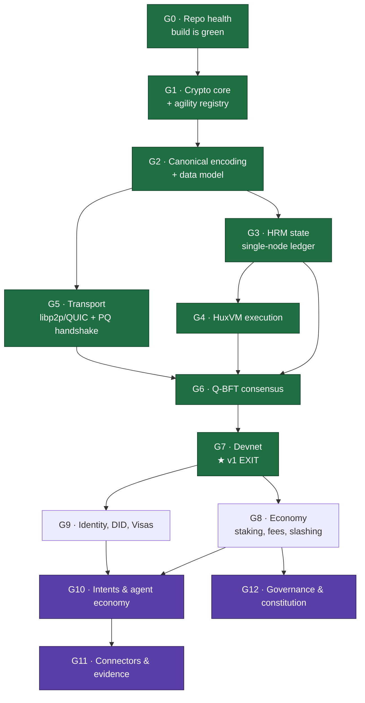

# 16 — Development Action Plan (Gated)

> **Purpose.** This is the build order. It converts the blueprint into a sequence of
> **gates**, each with a small set of **high-concept tests** that must pass before dependent
> work is allowed to start.
>
> **The rule this document exists to enforce:** a gate is not "done" when the code is
> written. It is done when its high-concept tests pass in CI. Until then, **no downstream
> gate may begin.** This is the mechanism against risk #1 in the executive summary — *scope
> collapse*, the most common way ambitious L1s die.

**Companion documents:** [`15-specifications/06-v1-scope.md`](15-specifications/06-v1-scope.md)
(what v1 is), [`09-roadmap/`](09-roadmap/) (calendar phases),
[`17-landscape-2026.md`](17-landscape-2026.md) (what the rest of the world is building),
[`brainstorming/`](brainstorming/) (founder's north star).

---

## 0. Ground truth as of this plan

Verified by reading `src/` and running the test suite, not by reading docs.

| Fact | Evidence |
|---|---|
| ~1,150 lines of implementation across `src/crypto/` and `src/network/` | `wc -l src/**/*.rs` minus test blocks |
| ~4,260 lines of **tests**, 189 `#[test]` functions | `src/crypto/mod.rs`, `src/network/mod.rs` |
| **Build is green on both architectures** — 105 passed, 0 failed, 84 ignored | `cargo test` on `aarch64-apple-darwin`; `cargo check --target x86_64-apple-darwin` |
| 84 ignored tests are conformance suites for four unimplemented primitives | `slh_dsa` (G1), `lb_vrf` / `pq_ssle` (G6+), `zk_stark` (G10) — each `#[ignore]` names its gate |
| No ledger, no consensus, no VM, no storage, no transport, no tokens, no agents | absence across `src/` |
| Connectors are now specified but unbuilt | [07-connector-protocol](15-specifications/07-connector-protocol.md), [ADR-0015](adr/0015-connector-architecture.md), [ADR-0016](adr/0016-evidence-and-attestation.md) |

> **G0 was completed on 2026-09-12.** Previously `cargo test` did not compile at all
> (3 × `E0433`, 5 × `E0432`, 1 × `E0121`), so none of the authored tests protected anything.
> The root cause of the architecture failure was `mlkem768::avx2::*` hardcoded at
> `src/crypto/kem.rs:13,20,27` — AVX2 is x86-64 only and does not exist on `aarch64`.
> See G0 below for what changed and what remains.

**Read this honestly:** the repository is a *spec-test-first* project. The founder has
written extensive conformance tests ahead of the implementations — including full FIPS 205
size and behaviour tests for SLH-DSA that no code satisfies yet. That is an unusual and
genuinely strong position: **the gates below are, in several cases, already authored.** The
work is to make them pass.

---

## 1. How to read a gate

Every gate has the same five parts:

| Part | Meaning |
|---|---|
| **Unblocks** | What may begin once this gate passes |
| **Entry** | What must already be true to start |
| **Work** | The implementation items |
| **🎯 High-concept tests** | The decisive properties. Few, named, falsifiable. Passing these *is* the definition of done |
| **Exit** | The mechanical checklist |

A **high-concept test** is not a unit test. It is a property that, if it fails, means the
layer is conceptually wrong rather than merely buggy. Each is written so that it can only
pass for the right reason.

---

## 2. The gate graph



**Green = the v1 critical path.** Purple = the founder's north star; not before G7.

### Critical path and parallelism

```
G0 → G1 → G2 → G3 → G4 → G6 → G7      (the binding sequence)
                └─ G5 ─────┘           (transport runs in parallel with G3/G4)
```

- **G5 (transport) is the only meaningful parallel track before G7.** If there are two
  people, one takes G3→G4, the other takes G5.
- **G8 and G9 are parallel** after G7.
- Everything in G10–G12 is sequential and late. Attempting them earlier is the failure mode.

---

# Part I — The v1 critical path

## G0 · Repository health — 🟢 mostly complete (2026-09-12)

> **The gate nobody wants to write and everybody needs.** Before this gate `cargo test` did
> not compile, which meant *none* of the authored tests protected anything.

**Unblocks:** everything. **Entry:** none.

### Work

| # | Item | Status |
|---|---|---|
| 1 | **ML-KEM backend selection.** `src/crypto/kem.rs` called `mlkem768::avx2::*` unconditionally — AVX2 is x86-64 only and does not exist on `aarch64` | ✅ Switched to libcrux's top-level *multiplexing* entry points, which detect CPU capability at runtime and fall back to portable. `Cargo.toml` now enables `simd256` on x86-64 and `simd128` (NEON) on aarch64, so both architectures get a fast backend. All backends are output-identical, so no test vector changed |
| 2 | **Four phantom modules.** `slh_dsa`, `lb_vrf`, `pq_ssle`, `zk_stark` were imported by tests but declared only in a comment | ✅ Created as `#[cfg(test)]` API-contract modules with `unimplemented!()` bodies, so the suites type-check against a fixed signature while **no unimplemented cryptography is reachable from the public API**. Their 84 tests are `#[ignore]`d with gate labels. No test was deleted |
| 3 | `E0121` — placeholder `_` in a return type | ✅ `make_validator_set` now returns `Vec<(SslePublicKey, SsleSecretKey)>` |
| 4 | Split `src/crypto/mod.rs` (3,607 lines) into `tests/` | ⬜ **Outstanding** — implementation and conformance suite still share a file |
| 5 | CI on both `x86_64` and `aarch64` | ⬜ **Outstanding** — verified locally, not yet wired into `.github/workflows/ci.yml` |
| 6 | *(added)* `src/lib.rs` declared modules privately, making the whole library dead code | ✅ Now `pub mod`, with `#![forbid(unsafe_code)]` enforcing Principle #8. Warnings went 24 → 0 |
| 7 | *(added)* `PeerId::from_ml_dsa_pk` used `std::io::Read::read`, whose short reads would silently zero-pad a peer identity | ✅ Now uses `XofReader::read`, which always fills the buffer. PeerId values unchanged (tests confirm) |

### 🎯 High-concept tests

| ID | Property | Status |
|---|---|---|
| **G0-T1** | `cargo test --all-targets` compiles and passes on x86-64 **and** aarch64 | 🟢 **105 passed, 0 failed, 84 ignored** on `aarch64-apple-darwin`; `cargo check` green on `x86_64-apple-darwin`. Not yet enforced in CI (item 5) |
| **G0-T2** | `cargo build --release` produces bit-identical artifacts across two clean checkouts | ⬜ Not yet established |
| **G0-T3** | Every `#[ignore]`d test names the gate that will un-ignore it | 🟢 All 84 carry `GATE: G1 / G6+ / G10` in the ignore reason |

**Ignored-test inventory:** `slh_dsa_128s_tests` 24 (G1) · `lb_vrf_tests` 17 (G6+) ·
`pq_ssle_tests` 16 (G6+) · `zk_stark_tests` 27 (G10).

**Remaining to close G0:** items 4 and 5, plus G0-T2.

> **Standing rule from this gate:** never call an architecture-specific backend path
> (`mlkem768::avx2::*`, `::neon::*`) directly. Always use the top-level dispatching entry
> point. Architecture portability is a decentralization property — a PQ chain whose crypto
> builds on only one ISA cannot have a diverse validator set.

---

## G1 · Crypto core and the agility registry

> The executive summary names crypto-agility as *"the top architectural priority, above any
> single algorithm choice."* Build the registry **before** the algorithms, or every later
> layer will hardcode an algorithm ID.

**Unblocks:** G2. **Entry:** G0.

### Work

1. **Versioned algorithm registry.** Every signed or hashed object carries an algorithm
   identifier; verification dispatches through the registry. No direct calls to a named
   scheme outside the registry.
2. **SLH-DSA-128s** — satisfy the FIPS 205 test module already written at
   `src/crypto/mod.rs:1728+` (PK 32 B, SK 64 B, sig 7,856 B). Per
   [ADR-0002](adr/0002-cryptographic-parameter-set.md) this is the long-lived
   identity/root-of-trust scheme; ML-DSA-44 stays the hot per-block signer.
3. **Byte-exact KAT fixtures** committed for ML-DSA-44, ML-KEM-768, SLH-DSA-128s, and the
   hash domains ([ADR-0010](adr/0010-hash-function-domains.md)).
4. Hybrid X25519 + ML-KEM-768 key agreement (needed by G5).
5. **Defer** `lb_vrf`, `pq_ssle`, `zk_stark` — v1 scope explicitly excludes them. Keep their
   tests `#[ignore]`d with `// GATE: G6+` / `// GATE: G10`.

### 🎯 High-concept tests

| ID | Property | Why it is decisive |
|---|---|---|
| **G1-T1** | **Algorithm rotation without state migration.** Register a second signature scheme, flip the registry default, and verify that objects signed under the *old* ID still verify while new objects use the new ID — with zero changes to any state structure | This is the entire crypto-agility thesis, reduced to one test. If it fails, Huxplex's central differentiator does not exist |
| **G1-T2** | **Cross-context replay must fail.** A signature valid under context `…:tx:v1` must fail verification under `…:block:prepare:v1`, and every ordered pair of the defined contexts must fail | Already partly tested 🟢. Domain separation is the property most likely to be silently broken by refactoring — pin it with an exhaustive pair sweep, not spot checks |
| **G1-T3** | **KAT byte-exactness.** Given fixed seeds, keys and signatures match committed fixtures byte-for-byte across both architectures | Guards against a backend swap (see G0-T1) silently changing outputs — which would fork the chain |
| **G1-T4** | **Unknown algorithm ID is rejected, never ignored.** An object bearing an unregistered ID fails closed with a distinct error | Fail-open on algorithm ID is how agility frameworks become downgrade attacks |
| **G1-T5** | **Hybrid handshake retains PQ security if the classical half is broken.** With X25519 output forced to a constant, derived session keys still differ per session | Proves the hybrid is genuinely hybrid rather than classical-with-decoration |

**Exit:** registry is the only path to a primitive; SLH-DSA test module un-ignored and green;
KATs committed; G1-T1 demonstrated in CI.

---

## G2 · Canonical encoding and the data model

> Two nodes that serialize the same object differently will fork. This gate is small,
> unglamorous, and load-bearing for everything after it.

**Unblocks:** G3, G5. **Entry:** G1.

### Work

Implement [`15-specifications/01-data-model-and-encoding.md`](15-specifications/01-data-model-and-encoding.md)
and [ADR-0011](adr/0011-canonical-serialization.md): canonical `Codec` (postcard), canonical
*decode* (reject non-canonical encodings), and the core types — `Resource`, `Transaction`,
`Block`, `Vote`, `GossipMessage`, `DhtEntry`.

### 🎯 High-concept tests

| ID | Property | Why it is decisive |
|---|---|---|
| **G2-T1** | **Round-trip and re-encode stability.** For every consensus type, `decode(encode(x)) == x` **and** `encode(decode(bytes)) == bytes` | The second half is the one that matters: it forbids two byte-strings decoding to the same value, which is the classic consensus-fork bug |
| **G2-T2** | **Non-canonical encodings are rejected at decode.** Hand-crafted alternate encodings of a valid object are refused | Without this, an attacker mints two valid `TxId`s for one transaction |
| **G2-T3** | **`TxId` excludes witnesses.** Mutating only the signature field leaves `TxId` unchanged | Prerequisite for post-finality signature pruning, which is load-bearing for PQ signature bloat (risk #2) |
| **G2-T4** | Differential fuzz: 10⁶ random byte-strings never panic and never decode into two distinct values | Decoders are the largest untrusted-input surface in the node |

**Exit:** all consensus types canonical; fuzz target in CI; G2-T3 proven.

---

## G3 · HRM state and the single-node ledger

**Unblocks:** G4, G6. **Entry:** G2.

### Work

Implement [`15-specifications/03-hrm-state-transition.md`](15-specifications/03-hrm-state-transition.md):
`CommitmentSet` + `NullifierSet` over a Jellyfish Merkle Tree with a `state_root`;
signature-logic transaction STF (the eUTXO subset — HuxVM program-logic may be stubbed);
RocksDB persistence; multi-dimensional `TxWeight`.

**Single shard only.** Stay forward-compatible with S-EUTXO; build nothing for it.

### 🎯 High-concept tests

| ID | Property | Why it is decisive |
|---|---|---|
| **G3-T1** | **No double-spend.** Consuming the same resource twice — in one block, across two blocks, and via two concurrent submissions — fails in all three cases | The nullifier set is the ledger's only real job. Test all three shapes; the intra-block case is the one implementations miss |
| **G3-T2** | **Determinism under permutation.** Applying a set of non-conflicting transactions in any order yields an identical `state_root` | Without this, G4's parallel execution and G6's consensus cannot agree. Property-test over random permutations |
| **G3-T3** | **Kind-balance is conserved.** No transaction creates or destroys value except through an explicitly authorized mint/burn resource | The economic invariant. Fuzz it adversarially, do not merely assert it |
| **G3-T4** | **Pruning preserves the root.** Drop all witness/signature data for finalized blocks; `state_root` is unchanged and the chain still validates from a snapshot | Proves the answer to risk #2 (PQ signature bloat) actually works, at the point where it is cheap to fix |
| **G3-T5** | **Crash consistency.** Kill the process at randomized points during commit; on restart the ledger is at a consistent height with no partial application | Storage engines fail here, and it is undiscoverable later |

**Exit:** ledger replays from genesis to a fixed root; all five tests green; snapshot restore
works.

---

## G4 · HuxVM execution

**Unblocks:** G6. **Entry:** G3.

### Work

Deterministic WASM ([ADR-0008](adr/0008-vm-engine.md)) with gas metering and typed host
functions; the TCHAO conflict-graph scheduler
([ADR-0009](adr/0009-parallel-execution.md)).

> **Open scope question from v1-scope §Open Questions:** whether HuxVM belongs in v1 at all,
> or whether signature-logic-only is the honest MVP. **Recommendation: split.** Ship
> **G4a** (gas-metered deterministic execution, sequential) inside v1; defer **G4b** (TCHAO
> parallel scheduling) to v1.x. Parallelism is a performance property, and v1's deliverable
> is *data*, not throughput.

### 🎯 High-concept tests

| ID | Property | Why it is decisive |
|---|---|---|
| **G4-T1** | **Bit-identical execution across platforms.** The same program and inputs produce identical output, gas, and `state_root` on x86-64 and aarch64 | Non-determinism in a VM is a consensus fork with a long fuse. Floats, NaN, memory growth, and iteration order are the usual culprits |
| **G4-T2** | **Gas is exhaustible and gas exhaustion is clean.** An infinite loop halts at the limit, charges the full limit, and leaves state untouched | The only defence against a hostile program halting the chain |
| **G4-T3** | **No ambient authority.** A program cannot read the clock, the filesystem, the network, or entropy except through a typed host function; attempts fail deterministically | This is the substrate-level enforcement principle from the founder's notes, applied to code rather than agents |
| **G4-T4** *(G4b)* | **Parallel ≡ sequential.** For random transaction batches, TCHAO's parallel result equals the sequential result, and conflicting transactions are never co-scheduled | The correctness condition for the entire parallel-execution claim |
| **G4-T5** *(G4b)* | Measured speedup is reported, and **≥ 1.0×** on a realistic mixed workload | Guards against shipping a scheduler that is a net loss — and produces a v1 research metric |

**Exit:** G4a tests green; deterministic across architectures; gas schedule documented.

---

## G5 · Transport and the P2P layer

> Runs **in parallel** with G3/G4. Today `src/network/` defines message *types* only — there
> is no swarm, no transport, no peer state machine.

**Unblocks:** G6. **Entry:** G2.

### Work

Implement [`15-specifications/05-network-wire-protocol.md`](15-specifications/05-network-wire-protocol.md)
and [ADR-0012](adr/0012-network-transport.md): libp2p/QUIC transport; hybrid
X25519 + ML-KEM-768 handshake with ML-DSA-44 authentication; GossipSub with the existing
signed envelopes; Kademlia DHT with signed entries; peer scoring and rate limits.

### 🎯 High-concept tests

| ID | Property | Why it is decisive |
|---|---|---|
| **G5-T1** | **Authenticated handshake, no downgrade.** A peer offering only classical key agreement is rejected; a MITM substituting its own ML-DSA key fails to complete | The PQ transport claim, tested at the only place it can be falsified |
| **G5-T2** | **`PeerId` is bound to the key.** `PeerId = SHAKE-256(pk)[..32]`; a peer cannot present a `PeerId` it does not hold the key for | Sybil resistance starts here 🟢 (already type-level tested) |
| **G5-T3** | **Gossip amplification is bounded.** Under a flood of malformed and unsigned messages, per-peer bandwidth stays bounded and the offender is scored down and disconnected | ML-DSA's 2,420-byte signatures make gossip amplification an unusually cheap DoS on this chain specifically |
| **G5-T4** | **Message propagation under partition.** With 20% packet loss and a healed partition, all honest nodes converge on the same message set | The property consensus will silently assume |
| **G5-T5** | **Signed DHT entries reject forgery and replay.** A record signed for one key cannot be republished under another, nor replayed after expiry | 🟢 struct-level tests exist; extend to the live DHT |

**Exit:** 5 nodes discover each other, gossip, and sustain a signed session over QUIC; abuse
tests green.

---

## G6 · Q-BFT consensus

**Unblocks:** G7. **Entry:** G3, G4a, G5. *(This is the join point — the plan's riskiest
gate.)*

### Work

Implement [`15-specifications/04-consensus-spec.md`](15-specifications/04-consensus-spec.md):
three-phase commit with quorum certificates over the block-phase contexts; DAG mempool
([ADR-0004](adr/0004-consensus-selection.md)); anti-double-sign signer guard;
slashing conditions; **round-robin leader** — LB-VRF and PQ-SSLE are explicitly deferred.

### 🎯 High-concept tests

| ID | Property | Why it is decisive |
|---|---|---|
| **G6-T1** | **Safety under f Byzantine nodes.** With n = 3f+1 and f nodes running an equivocating build, no two honest nodes ever commit conflicting blocks at the same height | The one property a consensus protocol cannot trade away. Run adversarial nodes, not simulated faults |
| **G6-T2** | **Liveness after partition heals.** Under a partition preventing quorum, the chain halts without forking; on heal it resumes from the last committed height | Correct BFT behaviour is *stop*, not *guess*. Verifies the chain prefers safety |
| **G6-T3** | **The signer guard is unconditional.** A validator process cannot be induced to sign two different blocks at the same height/round — including across a restart with a warm mempool | Double-signing is the slashable event; the guard must survive crash-restart, which is when it usually doesn't |
| **G6-T4** | **Every consensus message is context-bound.** A `Prepare` vote replayed as a `Commit`, or replayed into a different height/epoch, is rejected | Connects G1-T2 to the live protocol — the actual payoff of domain separation |
| **G6-T5** | **PQ signature overhead is measured and reported.** Bytes-per-block and verify-time attributable to ML-DSA are exported as metrics | v1's deliverable is *data*. This is the headline number the research report is built on |

**Exit:** 4-node cluster survives an adversarial soak; safety and liveness tests green;
metrics exported.

---

## G7 · Devnet — ★ the v1 exit gate

**Unblocks:** G8, G9. **Entry:** G6.

This gate **is** [`15-specifications/06-v1-scope.md`](15-specifications/06-v1-scope.md).
Do not restate it — satisfy it.

### 🎯 High-concept tests

| ID | Property | Why it is decisive |
|---|---|---|
| **G7-T1** | **24-hour soak.** 3–5 nodes produce and finalize blocks for ≥ 24 h with zero safety faults and no unbounded memory or state growth | The v1 exit criterion, verbatim |
| **G7-T2** | **A new node syncs from genesis** to the current head and reaches an identical `state_root` | Proves the chain is a *protocol* others can join, not one process's memory |
| **G7-T3** | **Restart-from-snapshot equivalence.** A node restored from a pruned snapshot produces the same roots as one replaying full history | Ties together G3-T4 pruning and G7-T2 sync — the combination is where bugs hide |
| **G7-T4** | **The research report is publishable.** PQ signature overhead, block time, state growth, and execution speedup are exported, plotted, and written up | *"The chain is a dataset generator."* If no report can be written, v1 produced nothing |
| **G7-T5** | **Zero agent-economy code on the consensus-critical path.** A dependency audit shows no `identity`, `visa`, `agent`, `intent`, or `connector` crate is reachable from consensus or execution | The structural defence against scope collapse. Automate it as a CI check, not a promise |

**Exit:** all of §2 of the v1 scope contract checked; report published; **G7-T5 enforced in
CI from this point forward.**

---

# Part II — After v1

> Nothing below may start before G7 passes. The founder's notes describe almost entirely
> this territory; they are the north star, **not** the build order.

## G8 · Economy — staking, fees, slashing

**Unblocks:** G10, G12. **Entry:** G7. Parallel with G9.

| ID | 🎯 High-concept test |
|---|---|
| **G8-T1** | **Slashing is provable and bounded.** Every slash is triggered by a self-contained cryptographic proof any node can verify independently, and no reachable sequence slashes an honest validator |
| **G8-T2** | **Fee market resists spam without pricing out honest users.** Under sustained spam, fees rise, the attack becomes uneconomic, and honest transactions still land within a bounded delay |
| **G8-T3** | **Conservation under adversarial load.** Total supply changes only via authorized mint/burn; fuzz the fee, stake, reward and slash paths together |
| **G8-T4** | **SNTNC cannot influence consensus.** Static and dynamic analysis proves no merit value reaches leader selection, vote weight, or ordering ([ADR-0007](adr/0007-sentience-framing.md)) |

## G9 · Identity, DID, and Work Visas — L3

**Entry:** G7. Parallel with G8. Implements [ADR-0013](adr/0013-did-huxplex-method.md).

**Adopt the 14-field visa schema** from the founder's notes
([`brainstorming/`](brainstorming/00-arun-babu-founding-notes.md) §Step 4) rather than the
4-field sketch in [`ai-agent-framework.md`](04-ai-economy/ai-agent-framework.md) — in
particular the deny-by-default negative capabilities (`subscription: No`,
`recurring_payment: NO`, `transfer_to_another_person: NO`).

| ID | 🎯 High-concept test |
|---|---|
| **G9-T1** | **The policy wins.** For randomly generated (visa, action) pairs, *every* action outside the visa is rejected — including ones the agent asserts are beneficial. This is the founder's ₹1,25,000 case as a property test, and it is the project's defining invariant |
| **G9-T2** | **Scope attenuation is monotonic.** Every delegation hop narrows authority; no chain of delegations, of any depth, yields a capability the root issuer did not hold. Fuzz over random delegation DAGs including cycles |
| **G9-T3** | **Revocation is sub-epoch and total.** After revocation, no in-flight action under that visa can settle — including one already in the mempool |
| **G9-T4** | **Enforcement is substrate-level, not advisory.** With a deliberately malicious agent client that ignores all constraints locally, zero out-of-scope actions reach finalized state |
| **G9-T5** | **Expiry is enforced against consensus time**, not wall-clock, and cannot be extended by the holder |
| **G9-T6** | **No raw biometrics on-chain.** Any personhood proof reveals nothing beyond a boolean and a nullifier (risk #8) |

> **G9-T1 and G9-T4 together are the whole thesis of Huxplex.** If they cannot be made to
> pass, the project's central claim is false and that is worth knowing early.

## G10 · Intents and the agent economy — L4

**Entry:** G8, G9. **Blocked by an ADR:** the two intent models must be reconciled first —
the blueprint's *unbalanced partial transaction* versus the notes' *objective + constraints
+ execution policy*. See [`brainstorming/README.md`](brainstorming/README.md) §3.1.

| ID | 🎯 High-concept test |
|---|---|
| **G10-T1** | **Hard constraints are inviolable; soft preferences are free.** Over random candidate sets, no solution violating a hard constraint is ever accepted, and among valid solutions the agent may optimize freely |
| **G10-T2** | **Intent lowering is faithful.** A user-facing intent lowers to a settlement transaction whose effects are within the declared constraints — verified by re-deriving constraints from the transaction |
| **G10-T3** | **Solvers cannot extract beyond their declared fee.** Adversarial solvers over random intents never capture surplus outside the fee, and front-running a pre-committed intent fails |
| **G10-T4** | **Long-running intents remediate correctly.** On constraint breach after settlement (the delayed-delivery case), the agent executes only the remediation its authorization permits |
| **G10-T5** | **Unverifiable work is never claimed as proven.** Tasks outside the verifiable class settle via escrow/dispute and are labelled as such — no zk claim is attached to subjective work |

## G11 · Connectors and the evidence model

**Entry:** G10. **Specified:** [`15-specifications/07-connector-protocol.md`](15-specifications/07-connector-protocol.md)
(HCP/1) — sessions, authorization envelopes, evidence classes, event streams, profiles, and the
full conformance suite G11-T1…T14. Two ADRs should still be extracted from it (the
build-on-MCP decision; the evidence-class model) to record *why this and not that*.

> **Classify this gate correctly.** Connectors are **not** bridges. A bridge is a custody
> and authority boundary — it holds value and its signature mints value, so compromise is
> unbounded theft. A connector holds nothing, cannot create authority (the visa is evaluated
> at L3 *before* the connector is invoked), and its worst case is *lying about an external
> fact* within an already-bounded envelope. It is an **oracle boundary**, and against the
> realistic alternative — an agent holding the user's card with unbounded API access — it is
> a security *improvement*.
>
> The genuine risks here are **liability, scope and maintenance**, not theft:
> who is merchant-of-record and who carries fraud liability; the notes' connector list
> (commerce → payment → shipping → robots → drones → government) is a wish list, not a
> roadmap; and every external API rots, which is the recurring cost that kills adapter
> layers. **One exception takes bridge-grade caution:** a connector that custodies on-chain
> value (stablecoin settlement) is custody-shaped and must be gated as a bridge.
>
> Discipline for this gate: **one connector category, done completely**, before a second is
> started.

| ID | 🎯 High-concept test |
|---|---|
| **G11-T1** | **Evidence is required, not optional.** No external action can be marked fulfilled on the strength of an agent's *claim*; a signed connector attestation is structurally required |
| **G11-T2** | **A compromised connector has bounded blast radius.** A fully malicious connector cannot exceed the visa limits of the intents routed through it, cannot forge another connector's attestations, and cannot affect unrelated state |
| **G11-T3** | **Evidence semantics are explicit.** A receipt hash proves *integrity*, not *authorization* or *completeness*, and the schema forces each claim to be labelled — the confusion identified in the 2026 evidence-model literature ([`17-landscape-2026.md`](17-landscape-2026.md) §5) |
| **G11-T4** | **Payment authority is separable from commerce authority.** Neither connector can perform the other's action, and Huxplex never holds the user's external credentials |
| **G11-T5** | **External failure is recoverable.** Connector timeouts, duplicate deliveries and out-of-order callbacks leave Huxplex state consistent — idempotency keyed on intent + nonce |

> The full suite is **G11-T1…T14** in
> [`15-specifications/07-connector-protocol.md`](15-specifications/07-connector-protocol.md) §16.
> The two decisive additions: **G11-T6** (a colluding agent *and* connector still cannot exceed
> the visa — the test for "must not override bounded authority") and **G11-T7** (a session
> survives node restart, agent-process death and connector disconnection — the test for "must
> stay open for the complete lifecycle").

## G12 · Governance and the constitutional layer

**Entry:** G8.

| ID | 🎯 High-concept test |
|---|---|
| **G12-T1** | **Constitutional invariants are unamendable.** No sequence of validly-passed proposals, of any length, can alter a constitutional invariant or the veto mechanism itself. Model-check it |
| **G12-T2** | **The human veto provably halts.** A SVRGN veto stops any non-constitutional proposal, including one already mid-execution |
| **G12-T3** | **Machine voting power is bounded.** Under simulated 100× agent population growth, agent-controlled voting power stays under the constitutional cap |
| **G12-T4** | **Upgrades are safe under partial adoption.** A protocol upgrade adopted by a bare majority either activates cleanly or does not activate — it never forks state |

---

## 3. Sequencing summary

| Gate | Depends on | Track | Phase |
|---|---|---|---|
| G0 Repo health | — | critical | now |
| G1 Crypto + agility | G0 | critical | 0 |
| G2 Encoding | G1 | critical | 0 |
| G3 HRM ledger | G2 | critical | 0–1 |
| G4a Execution | G3 | critical | 1 |
| G5 Transport | G2 | **parallel** | 0–1 |
| G6 Q-BFT | G3, G4a, G5 | critical | 1 |
| **G7 Devnet ★ v1** | G6 | critical | 1 |
| G8 Economy | G7 | parallel | 1–2 |
| G9 Identity + Visas | G7 | parallel | 2 |
| G4b TCHAO | G4a | deferred | 1.x |
| G10 Intents/agents | G8, G9 | north star | 3 |
| G11 Connectors | G10 | north star | 3–4 |
| G12 Governance | G8 | north star | 2–3 |

## 4. Standing rules

1. **A gate is done when its high-concept tests pass in CI.** Not when the code is written,
   not when it works locally.
2. **G7-T5 is permanent.** Once v1 ships, the CI check forbidding agent-economy code on the
   consensus path stays forever. Moving something onto that path requires an RFC.
3. **Adding to a gate requires an RFC**, exactly as
   [`06-v1-scope.md §5`](15-specifications/06-v1-scope.md) requires.
4. **Every deferred test carries its gate.** `// GATE: Gn` — the ignored-test inventory is
   the real backlog.
5. **Write the ADR before the code** for G10, G11 and G12. All three are blocked on
   decisions that have not been made.
6. **If a high-concept test cannot be made to pass, that is a finding, not a failure.**
   G9-T1 and G9-T4 in particular are falsification tests for the project's core claim.
   Report them honestly.

---

### Open Questions

- **G4 split:** is signature-logic-only genuinely enough for v1, deferring all of HuxVM to
  v1.x? This plan recommends shipping G4a and deferring G4b, but the stronger position —
  defer all of G4 — would shorten the critical path to G0→G1→G2→G3→G6→G7.
- **G6 is the join point** for three upstream gates and is the plan's schedule risk. Is
  there a useful intermediate milestone — for example, single-validator block production
  after G3 — that de-risks it by exercising the block pipeline before consensus lands?
- **G11's blast radius:** can a connector ever be permissionless, or must the connector set
  be governance-gated indefinitely? The bridge precedent argues for permanently gated.
- **Who verifies G9-T2** (scope attenuation over arbitrary delegation DAGs)? This may need
  a model checker rather than property tests.
- Should G0 also establish a **reproducible-build attestation** in CI, given the mission's
  neutrality criterion, or is that Phase 2 work?
