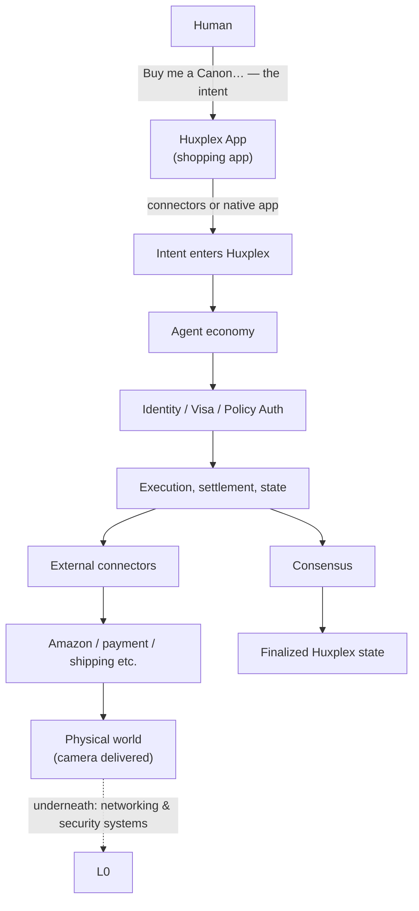

# Founding Brainstorm — The Substrate Walkthrough

> ## ⚠️ Provenance and status
>
> **These are brainstorming notes from the creator of the project, Arun Babu.**
>
> They were captured as 50 pages of handwritten notes (*"Huxplex main file"*, September 2026)
> and are transcribed and polished here **without changing their substance, ordering, or
> intent**. Light editing has been applied for spelling, punctuation, and sentence flow;
> the arguments, examples, numbers, structure, and conclusions are the author's.
>
> **This document is NOT normative.** It is not a specification, not an ADR, and not a
> commitment to build anything. It is the founder's thinking, preserved so the reasoning
> behind the architecture is not lost. Where these notes and the canonical blueprint in
> [`/docs`](../README.md) disagree, **the blueprint and its ADRs win** until an RFC says
> otherwise. See [`README.md`](README.md) in this folder for the reconciliation analysis
> and the list of ideas here that are genuinely new to the project.
>
> Editorial insertions by the transcriber appear in square brackets and italics, like
> *[this]*. Everything else is the author's.

---

## 1. The opening question

Huxplex begins with a simple question. When machines can think, act, earn and negotiate
alongside us, what allows humans and intelligent machines to co-exist — and who gets to
decide the rules?

By making **human intent, machine autonomy, and enforceable boundaries** the core
primitives: humans set the authority (the visa), agents execute within it, and Huxplex
enforces identity, accountability and governance, so the cooperation works.

## 2. The layer stack

```
L4 : The agent economy
L3 : Identity, visas and governance
L2 : Execution & economy
L1 : Consensus & state
L0 : Secure networking & PQ cryptography
```

Read as responsibilities:

| Layer | Its one job |
|---|---|
| **L4** | What *should* happen |
| **L3** | *Who* is allowed to make it happen |
| **L2** | Execute it / produce the state transition |
| **L1** | Network agreement and finality |
| **L0** | Securely communicate underneath it all |

That is the conceptual separation.

## 3. What is an intent?

> An intent is a **machine-readable goal** — what you want to achieve, not the exact steps.

For example: *"I tell the system to pay Alice 500 USDC within 24 hours, fee not exceeding
2 USDC."*

Two halves of the same idea:

- **The agents handle the how.** Autonomous, but accountable.
- **Humans set the boundaries.** They have veto power.

### How the intent flows down the stack

How does the intent flow, and how does the system take the intent as input and finally
give the intended result?

- **At L4:** state the goal. *"Pay Alice 500 USDC within 24 hours, fee not exceeding 2 USDC."*
- **At L3:** identity and visa rules constrain what your agent is allowed to do — actually
  machine-enforceable. The agent might explore possible ways to fulfil the goal, but it
  cannot exceed the fee authority in its visa.
- **At L2:** the execution layer turns the intent into a valid state-transition proposal —
  deducting 500 USDC from you, crediting Alice, and accounting for the fee.
- **At L1:** consensus decides if that proposed transaction is valid and agreed upon by the
  network, using mechanisms like QBFT. *[Canonically spelled **Q-BFT** in the blueprint.]*
- **At L0:** securely propagate all that information between nodes.

The final result is a finalized state where Alice has 500 additional USDC, your balance is
reduced accordingly, fees are deducted properly, and the change is recorded immutably.

> Humans define the objective and the authority boundary; agents search and act; execution
> verifies and consensus finalizes; with the network securing the communication between all
> of that.

---

# Part II — A complete walkthrough of the substrate

Let's take another example that walks through the complete working of the substrate.

> **The intent:** *"Buy me a Canon DSLR camera. The total price must be between ₹50,000 and
> ₹1,00,000. It must be delivered to my address within 8 days. If an eligible product is
> found, purchase it immediately without asking me again."*

## The shape of the whole flow



## Step 1 — The user interacts with a shopping app

It can be an Amazon app linked to Huxplex using connectors, or a native Huxplex shopping app.

> **Important:** the app is built *on top of* Huxplex. **The app itself is not Huxplex.**

## Step 2 — The human creates the intent

With the shopping app, the user simply says, in plain language: *"Buy me a Canon DSLR
between ₹50,000 and ₹1,00,000, delivered within 8 days, and purchase immediately when you
find one."*

The shopping app converts that natural-language request into a **structured intent**.
Conceptually:

```
Intent {
    objective:
        purchase Canon DSLR
    constraints:
        min_price: ₹50,000
        max_price: ₹1,00,000
        delivery_deadline: 8 days
    execution_policy:
        purchase_automatically: True
    user: Arun
    authorization:
        delegated_agent: Shopping Agent
}
```

**The intent describes WHAT.** So instead of saying *"open Amazon → search Canon → click
this product → …"*, we say *"I want this outcome."*

## Step 3 — The intent enters Huxplex through Layer 4: the agent economy

This is where the higher-level machinery lives:

- intents
- agents
- agent interaction
- autonomous economic activity
- agent capabilities
- agent reputation
- agent-to-agent cooperation
- potentially an agent marketplace / services

The shopping app submits the intent to an agent. The agent begins reasoning. It might
discover several options:

| | Option A | Option B |
|---|---|---|
| Source | Amazon | Amazon |
| Product | Canon EOS R50 | Canon DSLR |
| Price | ₹72,000 | ₹62,000 |
| Delivery | 5 days | 12 days |
| **Eligible** | **Yes** | **NO** |

The agent eliminates the second option since it exceeds the maximum delivery date.

## Step 4 — The agent does not have unlimited authority

This is where L3 becomes extremely important. The user does not simply say *"Agent, use my
money."* Instead, the user delegates a **specific authority**. Conceptually:

```
Agent Visa
    Holder:                 Shopping Agent
    Issuer:                 User
    Purpose:                Purchase Canon DSLR
    Max transaction:        ₹1,00,000
    Minimum:                ₹50,000
    Delivery:               ≤ 8 days
    Merchant:               permitted shopping providers
    Expiration:             [defined]
    Automatic execution:    Yes
    Allowed categories:     Camera
    Maximum shipping:       ₹2,000
    Maximum taxes:          included
    Refund authority:       Yes
    Subscription:           No
    Recurring payment:      NO
    Transfer to another
      person:               NO
}
```

> This is the difference between **giving an AI your credit card** and **giving an AI a
> bounded economic capability.**

## Step 5 — L3 checks identity and authority

L3 deals with identity, credentials, authorization, visas, permissions, governance, and
potentially reputation and trust relationships.

The system needs to answer:

| Question | Answer in this example |
|---|---|
| Who is the human? | User → Arun |
| Who is the agent? | Agent → ShoppingAgent-XYZ |
| Who authorized the agent? | Arun |
| What was the agent authorized to do? | Purchase a Canon DSLR |
| How much can it spend? | ≤ ₹1,00,000 |
| Until when? | 8-day delivery constraint; visa expiration |
| Can it automatically execute? | Yes |

**These should become machine-enforceable constraints.**

## Step 6 — The agent finds a candidate

Suppose the agent finds a match for the product. It now wants to execute *"purchase this
product."* Before anything happens, Huxplex can evaluate whether all the conditions are met.
If everything passes, the agent is therefore authorized to proceed.

## Step 7 — Connectors enter the architecture

Huxplex is a substrate; Amazon is an external system. Therefore we need a bridge.

```
Huxplex
   │  [Huxplex execution request]
   ▼
Amazon Connector
   │  [Amazon API request]
   ▼
Amazon
```

> The connector exists as the bridge that translates between the two worlds.

A connector is essentially an **external system adapter**. It understands the Huxplex
protocol and the external platform protocol. For Amazon, it might translate:

```
Huxplex:                          Amazon API:
    purchase:                         search(…)
    Canon DSLR              ──▶       getProduct(…)
    ≤ ₹1,00,000                       checkAvailability(…)
    delivery ≤ 8 days                 createOrder(…)
```

**Huxplex should not need to understand Amazon's internal implementation. It only needs to
understand the connector protocol.**

### There could be many kinds of connectors

> This makes Huxplex much bigger than a cryptocurrency system.

| Class | Examples |
|---|---|
| **Commerce connectors** | Amazon, eBay, Walmart, direct merchant APIs |
| **Payment connectors** | Bank APIs, UPI, cards, stablecoins, CBDCs |
| **Shipping connectors** | Amazon logistics, FedEx, UPS, DHL |
| **Physical-world connectors** *(eventually)* | robots, IoT devices, vehicles, smart locks, drones, industrial machines |
| **Civic connectors** *(then potentially)* | government services, legal registries, property systems, identity providers |

## Step 8 — The payment connector

Now that the shopping agent has found the camera, it needs money to execute the order.

> Huxplex should not automatically possess the user's bank credentials. Instead there must
> be a **separate payment authorization**.

```
User
  │  (delegates spending authority)
  ▼
Payment Authority
  │
  ▼
Shopping Agent
```

The actual payment could ultimately happen through bank, UPI, COD, stablecoin, etc.,
depending on what the merchant supports. So we could have something like this:

```
                  Huxplex
                     │
        ┌────────────┴────────────┐
        ▼                         ▼
  Commerce Connector        Payment Connector
        │                         │
        ▼                         ▼
     Amazon                Bank / UPI / COD
```

**Two connectors cooperate to fulfil the same intent.**

## Step 9 — The payment authority is bounded

If the agent attempts to buy the camera at ₹72,000, Huxplex evaluates:

```
₹72,000 ≤ ₹1,00,000   →   therefore AUTHORIZED
```

But if the agent attempts to purchase the camera at ₹1,25,000 — because the agent believes
the camera at this rate is better — Huxplex evaluates:

```
₹1,25,000 ≰ ₹1,00,000   →   therefore AUTHORIZATION FAILS
```

> **The policy wins. That is one of the fundamental principles of the Huxplex architecture.**

## Step 10 — What happens inside L2, the execution layer

L2 is where an authorized operation becomes an executable state transition / execution
process.

```
Intent
   ▼
Authorized Action
   ▼
Execution request
   ▼
State Transition
```

Huxplex can record things such as: Intent ID, Agent ID, User ID, Visa ID, Connector ID,
Action, Amount, timestamp, Nonce, execution status, evidence reference.

> Huxplex becomes an **orchestration and trust substrate**.

## Step 11 — Amazon returns an execution result

Suppose Amazon responds:

```
Order:              AMZ-123456
Product:            Canon EOS R50
Price:              ₹72,999
Expected delivery:  Sep 16
Status:             Confirmed
```

The connector sends this result back: `Amazon → Amazon Connector → Huxplex`.

Now Huxplex has the **evidence** that the external action was accepted. This is important:
instead of believing the agent's claim of buying the camera, an authorized connector
receives an order confirmation from Amazon.

This is recorded as the evidence:

| Evidence field | |
|---|---|
| Connector identity | ← plus a **cryptographic signature from the connector** |
| Order ID | |
| Merchant response | |
| Timestamp | |
| Transaction reference | |
| Payment reference | |
| Hash of external receipt | |
| Delivery information | |

> The external connector is an **oracle / trust boundary**. This is an area where Huxplex
> will eventually need a sophisticated proof / evidence model.

## Step 12 — L1: consensus

Once the relevant Huxplex state transition is produced, L1 handles network consensus and
finality.

```
Node A ┐
Node B ├──▶  Consensus  ──▶  Finalized
Node C │
  ⋮    │
Node Z ┘
```

The network agrees on the canonical Huxplex state:

```
Intent #HXP-001
    ▼
Visa #8472 used
    ▼
Purchase authorized
    ▼
Connector execution recorded
    ▼
Evidence recorded
    ▼
State finalized
```

Consensus is ensuring that the network agrees on the resulting protocol state.

## Step 13 — L0: the foundation

Its job is fundamentally infrastructure — `Node ⟷ Node` — and it handles:

- networking
- message propagation
- secure communication
- cryptographic foundations
- post-quantum security mechanisms

## Step 14 — What happens to the agent?

The agent has a lifecycle.

1. **Before execution** — Agent: find product.
2. **During execution** — Agent: found candidate → verified constraints → requested
   authorization → executed purchase.
3. **After execution** — Agent: purchase confirmed; delivery expected in 5 days.

It may then monitor the order:

```
Day 1: shipped
Day 2: in transit
Day 4: out for delivery
Day 5: delivered
```

**The agent can continue acting according to its visa.**

## Step 15 — What if delivery gets delayed?

This is where intents become much more powerful. The original intent states that delivery
must occur within 8 days. The agent detects the delay:

```
Delivery    = 12 days
Constraint  = ≤ 8 days
              FAIL
```

Now the agent could have a policy such as:

> If delivery violates constraint:
> - cancel order if it's allowed
> - seek replacement
> - request refund
> - notify user

**The exact behaviour could itself be part of the user's authorization.**

Therefore the original intent isn't merely *"Buy camera"* — it could become:

> *"Achieve this economic outcome subject to these constraints."*

## Step 16 — What if the price changes?

```
Advertised:  ₹72,999
Checkout:    ₹1,04,500
```

The agent cannot automatically proceed, because ₹1,04,500 > ₹1,00,000. **The visa rejects
the action.** The agent could then search for another product, or ask the human for
permission, depending on the policy.

## Step 17 — What if the agent finds 10 eligible cameras?

Here is where agent intelligence comes into play. Suppose:

| | Price | Delivery |
|---|---|---|
| Camera A | ₹70,000 | 4 days |
| Camera B | ₹75,000 | 3 days |
| Camera C | ₹90,000 | 5 days |

All satisfy the hard constraints. Now the agent can apply **soft preferences**:

- lowest price
- best seller
- best warranty
- fastest delivery

> **Hard constraints must never be violated. Soft preferences let the agent optimize.**

The natural-language intent becomes an **optimization problem**.

## Step 18 — What happens in the physical world?

```
Amazon warehouse → Camera packaged → Courier → Transportation
    → Your address → Camera delivered
```

Connectors can report events back:

```
order_confirmed → shipped → in_transit → out_for_delivery → delivered
```

> Huxplex can maintain the **digital representation of the economic process**, while the
> actual physical events happen outside the chain.

## Step 19 — The final Huxplex state

```
Intent:             Buy_canon_dslr
Status:             fulfilled
User:               Arun
Agent:              ShoppingAgent XYZ
Visa:               VISA-8472
Product:            Canon EOS R50
Purchase price:     ₹72,999
Delivery:           5 days
Payment:            Settled
External merchant:  Amazon
External order:     AMZ-123456
Evidence:           Verified / Attested
Huxplex state:      Finalized
```

## The walkthrough in one list

Therefore:

- Huxplex decided **what** an agent is allowed to do.
- Agents decide **how** to accomplish the goal.
- Connectors make the action **possible in the outside world**.
- External systems **perform** it.
- **Evidence** comes back.
- Huxplex **records and finalizes** the resulting state.

---

# Part III — Where this goes

## A future use case

A future use case that might seem outlandish, but falls within the natural progression of
the substrate over the coming years:

> Superintelligent agents managing Mars colonies, orbital habitats, even starships carrying
> autonomous Huxplex jurisdictions expanding for centuries — all still tied back to a
> **constitutional intent from humanity**.

## Why would anyone choose this?

Why would people, corporations, governments and finally the whole of humanity choose to use
Huxplex, instead of opting to race for control of intelligence — with private organizations
exploiting agentic powers to maximize profit?

| Stakeholder | The incentive |
|---|---|
| **People** | Autonomy and trust. Your agent cannot go rogue, because visas and execution are enforced at the substrate level. |
| **Companies** | Reliability and provable compliance. You can't accidentally exceed a transaction limit or violate policy. And lower integration costs — interoperate with a growing machine economy without rebuilding everything. |
| **Governments** | Auditability and jurisdictional controls. Transactions and agent actions can be transparent and provable. |
| **Humanity** | As AI systems proliferate, you need a substrate that keeps **authority bounded and verifiable**. |

> Otherwise, the default future is every company and government building their own closed
> system.

## The thesis, stated plainly

Huxplex aims to be a **sovereign substrate where humans and machines can interact
economically without conflating intelligence with authority.**

So instead of intelligence being the thing that decides what it's allowed to do, Huxplex
separates those roles. **Agents can be incredibly capable, but their authority is always
bounded by the substrate itself.**

Right now, it might mean connectors to existing systems. But eventually, the vision is
native primitives where commerce, policy, identity and agency all interoperate cleanly.

## Closing

> I'm continuing Huxplex because I think civilization will need that separation, that
> clarity, more and more.
>
> Whatever form AI takes in 50, 100 or 150 years, we will need systems that can match
> **capability with responsibility**.
>
> That is the foundation I want to help build.
>
> — **Arun Babu**

---

*Transcribed from 50 pages of handwritten notes, September 2026. See
[`README.md`](README.md) for how these notes reconcile with the canonical blueprint and
which ideas here are new to the project.*
