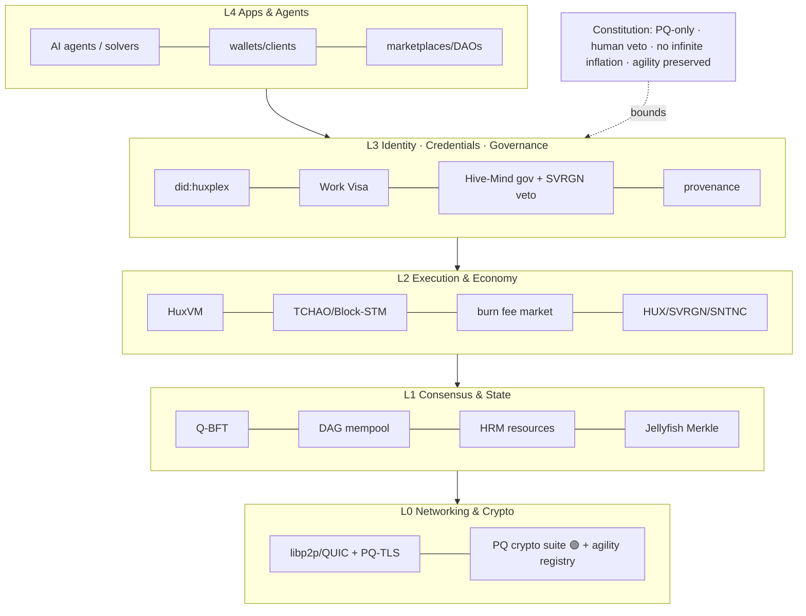

# Architecture Diagrams

Diagrams live **inline** (as Mermaid) in the docs they explain, so they stay next to their
context and never drift. This page indexes the key ones and provides two consolidated
"big-picture" diagrams.

## Diagram index

| Diagram | Location |
|---|---|
| Layered system architecture | [system-overview](../02-architecture/system-overview.md) |
| End-to-end tx/intent lifecycle | [system-overview](../02-architecture/system-overview.md) |
| Critical-path dependency graph | [00-executive-summary](../00-executive-summary.md) |
| Threat surface map | [vision threat-model](../01-vision/threat-model.md) |
| Q-BFT phases | [consensus](../02-architecture/consensus.md) |
| PQ-TLS hybrid handshake | [networking](../02-architecture/networking.md) |
| Storage tiers | [storage](../02-architecture/storage.md) |
| HRM intent → solver settlement | [state-management](../02-architecture/state-management.md) |
| Crypto suite → layers | [cryptography](../02-architecture/cryptography.md) |
| Crypto migration state machine | [migration-strategy](../03-post-quantum/migration-strategy.md) |
| Agent lifecycle + control | [ai-agent-framework](../04-ai-economy/ai-agent-framework.md) |
| Agent wallet constraint enforcement | [agent-wallets](../04-ai-economy/agent-wallets.md) |
| Hive-Mind governance flow | [governance-model](../07-governance/governance-model.md) |
| Constitutional amendment super-process | [constitutional-layer](../07-governance/constitutional-layer.md) |
| Incident-response lifecycle | [incident-response](../08-security/incident-response.md) |
| Per-phase critical paths | [roadmap phase docs](../09-roadmap/) |
| Monitoring metric taxonomy | [monitoring](../13-operational/monitoring.md) |

## Big picture 1 — The whole stack

## Big picture 2 — Reality vs. blueprint (what exists)

```mermaid
graph LR
    subgraph BUILT["🟢 Built today (~1.2k LOC primitives)"]
        C1[ML-DSA-44 + ML-KEM-768]
        C2[BIP32→ML-DSA HD]
        C3[domain-separated contexts]
        C4[PeerId + signed gossip/DHT types]
    end
    subgraph SPEC["🟡 Specified in this blueprint (unbuilt)"]
        S1[HRM state + nullifiers]
        S2[Q-BFT + DAG mempool]
        S3[HuxVM + TCHAO]
        S4[real P2P transport]
        S5[tokens/staking/governance]
        S6[identity + agent economy]
    end
    subgraph OPEN["🔴 Open research"]
        O1[PQ sig aggregation]
        O2[proof-of-personhood]
        O3[novelty/merit anti-gaming]
        O4[cross-shard atomicity]
    end
    BUILT --> SPEC --> OPEN
```

## Conventions

- **Mermaid only** (renders on GitHub; diffable; lives with the prose).
- Status tags 🟢/🟡/🔴 (built / specified / open) used consistently.
- Keep diagrams focused — one idea each; link to the doc for detail.

---

*To add a diagram: put the Mermaid block in the relevant doc and add a row to the index above.*
</content>
