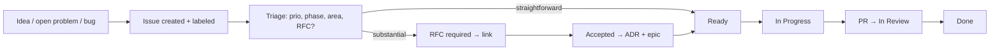

# GitHub Project Planning

How to run Huxplex delivery on GitHub: project board, labels, milestones, issue/RFC flow. This
maps the [roadmap](../09-roadmap/) and [backlog](../backlog/) onto trackable GitHub artifacts.

## Project board structure

A single **GitHub Project (v2)** board, with views:

| View | Grouped by | Purpose |
|---|---|---|
| **Roadmap** | Phase (0–4) | strategic, timeline view |
| **Now / Next / Later** | priority | execution focus |
| **By subsystem** | crate/area label | team/area ownership |
| **Critical path** | custom field `critical-path` | the blocking sequence |
| **Research** | research track | open-problems progress |

Columns (status): `Backlog → Ready → In Progress → In Review → Blocked → Done`.

## Milestones = phase gates

Create a milestone per roadmap phase with the **exit criteria** as the definition of done:

- `Phase 0 — Research` → exit criteria from [phase0](../09-roadmap/phase0-research.md).
- `Phase 1 — Testnet`, `Phase 2 — Mainnet`, `Phase 3 — AI Economy`, `Phase 4 — Global Scale`.

A milestone closes only when its doc's exit-criteria checklist is fully checked.

## Labels

| Group | Labels |
|---|---|
| Type | `type:feature` `type:bug` `type:research` `type:docs` `type:security` `type:chore` |
| Subsystem | `area:crypto` `area:consensus` `area:state` `area:vm` `area:network` `area:economy` `area:identity` `area:governance` `area:zk` `area:ops` |
| Priority | `prio:critical` `prio:high` `prio:medium` `prio:low` |
| Severity (bugs) | `sev:0` `sev:1` `sev:2` `sev:3` (maps to [incident-response](../08-security/incident-response.md)) |
| Process | `needs-rfc` `needs-adr` `needs-audit` `good-first-issue` `help-wanted` `blocked` |
| Phase | `phase:0` … `phase:4` |
| Risk | `risk:catastrophic` (maps to threat register) `critical-path` |

## Issue flow

## Epics

Large items from the [backlog](../backlog/) become **epics** (tracking issues) linking child
issues, e.g.:
- `EPIC: Crypto-agility registry` (refactor sizes, suite versioning, dummy-V2 migration test).
- `EPIC: Q-BFT devnet` (consensus prototype → 3–5 node finality).
- `EPIC: HRM ledger + HuxVM` (state + execution MVP).
- `EPIC: Proof-of-personhood` (research → portfolio).

Each epic links to its blueprint section, ADR(s), and open-problem IDs.

## Automation

- Issues/PRs auto-add to the board; status moves on PR open/merge.
- `needs-rfc` blocks `In Progress` for consensus/crypto/economic areas (label-gate).
- Security issues route to a private channel, never the public board.
- Release issues link the governance proposal + activation height ([protocol-upgrades](../07-governance/protocol-upgrades.md)).

## Cadence

- Weekly triage; per-phase planning aligned to milestones; monthly research review against the
  [open-problems register](../11-research/open-problems.md).
- Phase-gate review: confirm exit criteria + revisit threat register + open problems before
  advancing the milestone.

---

*This is the operating system for delivery; the [backlog](../backlog/) provides the seed issues to
populate it on day one.*
</content>
