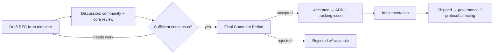

# Huxplex RFC Process

RFCs (Requests for Comments) are how **substantial** changes to Huxplex are proposed, debated, and
accepted. They precede the code and, when accepted, produce an [ADR](../adr/) recording the
decision.

## When an RFC is required

| Change | RFC? |
|---|---|
| Consensus / state / execution / crypto changes | **Yes** (always) |
| Economic / tokenomic / governance changes | **Yes** |
| New protocol features (identity, agent economy, ZK) | **Yes** |
| Crypto-suite addition/migration | **Yes** (+ ADR + audit) |
| New public API / SDK surface | Usually |
| Bug fixes, refactors, docs, tests | No (normal PR) |

Rule of thumb: if it's hard to reverse, touches consensus safety, or changes incentives — RFC it.

## Lifecycle

- **Draft** → **Discussion** → **Final Comment Period (FCP)** → **Accepted/Rejected**.
- Accepted RFCs get an ADR (the durable decision record) and a tracking issue/epic in the
  [backlog](../backlog/).
- Protocol-affecting RFCs, once implemented, still go through **on-chain governance** with a
  time-lock before activation ([protocol-upgrades](../07-governance/protocol-upgrades.md)).

## Numbering & status

- `RFC-XXXX-short-title.md`, sequential.
- Status: `Draft` → `Discussion` → `FCP` → `Accepted` | `Rejected` | `Withdrawn` → `Implemented`.

## Files

- [`TEMPLATE.md`](TEMPLATE.md) — copy this to start an RFC.
</content>
